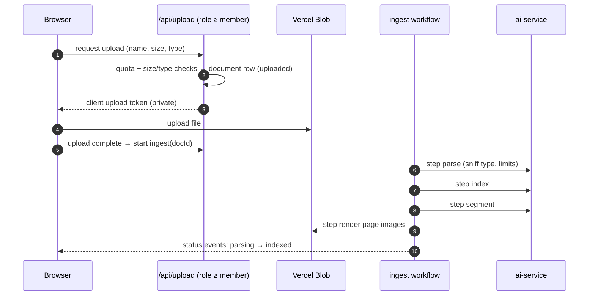

# F4: Upload & Ingestion Workflow

| Milestone | Priority | Depends on | Effort | Unblocks |
|---|---|---|---|---|
| M2 | Must | F3 | 5 h | F5, F6, F10 |

**Goal:** Direct-to-blob uploads with checks, then a **durable ingestion workflow** (parse → index →
segment → page images) with statuses streamed to the library. There is also a deletion workflow that
removes everything derived from a document.

## Diagram: upload and ingest



## Deliverables / files
```
app/api/upload/route.ts           # token issue after checks
workflows/ingest.ts               # "use workflow"; steps with retries
workflows/delete-document.ts      # blob + chunks + register rows + audit
lib/files/sniff.ts                # magic-byte type check, size/page limits
```

## Tasks
- [ ] Upload route with role check, size/type limits, per-org upload rate limit
- [ ] Ingest workflow with steps and retries (×3); status transitions saved and streamed
- [ ] Delete workflow; audit events
- [ ] Usage events for pages ingested (credits in F14)

## Acceptance criteria
- Uploading 10 contracts ingests them all; a forced failure in `index` retries and then succeeds
- A redeploy during ingestion doesn't lose documents

## Tests
- Unit tests for sniffing; workflow step tests with a fake ai-service; E2E upload flow (mock parse)

**Interview talking point:** *"Ingestion is a durable workflow, not a background promise, so a deploy in
the middle of parsing 40 contracts just picks up at the next step."*
