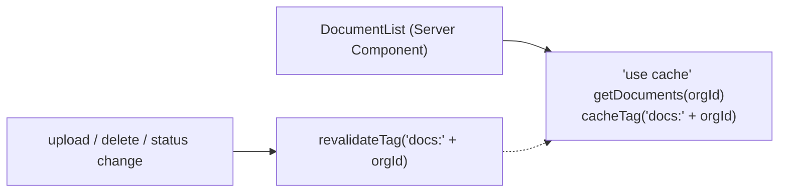
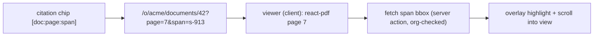

# F5: Document Library & Viewer

| Milestone | Priority | Depends on | Effort | Unblocks |
|---|---|---|---|---|
| M2 | Must | F4 | 5 h | F7 |

**Goal:**
- A server-rendered document library with org-scoped caching.
- A PDF viewer that opens at any cited span and highlights it using the stored bounding boxes.

## Diagram: caching and invalidation



## Diagram: citation → highlight



## Deliverables / files
```
app/o/[org]/documents/page.tsx           # library (status badges, filters)
app/o/[org]/documents/[id]/page.tsx      # viewer shell
components/viewer/PdfViewer.tsx          # react-pdf + text layer + highlight overlay
lib/files/signed-url.ts                  # ≤ 5 min signed URLs after org check
```

## Tasks
- [ ] Library with `"use cache"` + tag per org; live status via a small client island
- [ ] Viewer with page virtualization; highlight overlay from bboxes
- [ ] Signed download URLs; originals served as attachments
- [ ] Fallback: page-level highlight + snippet when a bbox is missing

## Acceptance criteria
- Opening a citation lands on the right page with the span highlighted
- LCP on the library ≤ 2.5 s on a preview (checked again in F19)

## Tests
- Component test for bbox → overlay mapping; E2E click-through from a citation (after F7)

**Interview talking point:** *"Every cached list is tagged by organization, so one team's cache can never
be served to another, and uploads invalidate exactly their own tag."*
