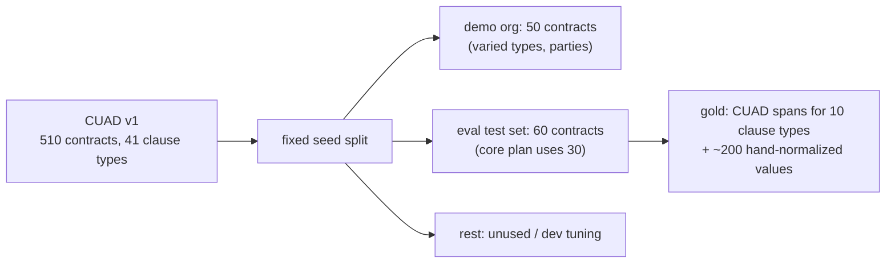

# F6: CUAD Seed & Eval Split

| Milestone | Priority | Depends on | Effort | Unblocks |
|---|---|---|---|---|
| M2 | Must | F4 | 2 h | F18, the demo |

**Goal:** Load CUAD contracts into a **demo organization** through the real ingestion workflow, and keep a
separate, fixed **evaluation split** that never appears in the demo.

## Diagram: split



## Deliverables / files
```
scripts/cuad/download.ts      # fetch CUAD v1 (CC BY 4.0), checksum
scripts/cuad/split.ts         # fixed split with a committed manifest
scripts/cuad/seed-demo.ts     # upload through the app's ingestion path
evals/cuad/gold/*.json        # spans + normalized values for eval contracts
NOTICE.md                     # CUAD attribution
```

## Tasks
- [ ] Download + checksum; split manifest committed
- [ ] Seed via the real ingestion workflow (tests the path end to end)
- [ ] Hand-normalize ~200 values (notice days, renewal months, caps) for eval contracts
- [ ] Attribution in the app footer and NOTICE

## Acceptance criteria
- The demo org has 50 indexed contracts; the eval split's ids are never in the demo org (checked by a test)

**Interview talking point:** *"The demo data and the evaluation data come from the same expert-labelled
dataset but never overlap, so the demo can't flatter the numbers."*
