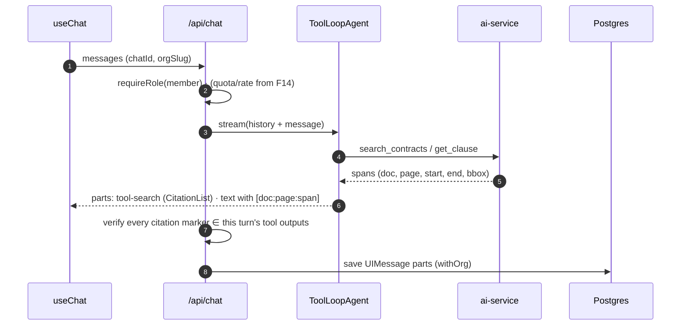
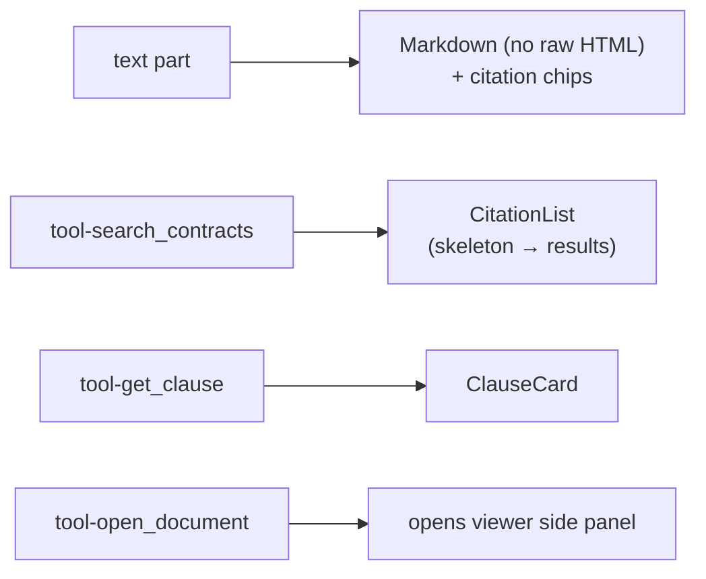

# F7: Chat Agent & Citations

| Milestone | Priority | Depends on | Effort | Unblocks |
|---|---|---|---|---|
| M3 | Must | F3, F5 | 7 h | F8, F9, F14, F18 |

**Goal:** Streaming chat with an AI SDK 7 `ToolLoopAgent`, read tools over the ai-service, typed tool UI
parts (AI Elements), **verified citations** that open the viewer, and persistent chat history.

## Diagram: one turn



## Diagram: UI parts



## Deliverables / files
```
lib/ai/agent.ts            # ToolLoopAgent, stopWhen, instructions (cite everything; documents are data)
lib/ai/tools/*.ts          # search_contracts, get_clause, open_document (Zod input schemas)
lib/ai/citations.ts        # marker parsing + verification (port of Project 1's check)
lib/ai/models.ts           # two providers; fallback on provider error
app/api/chat/route.ts
app/o/[org]/chat/[id]/page.tsx   components/chat/*.tsx (AI Elements)
```

## Tasks
- [ ] Agent + read tools; ai-service calls with a 60 s service JWT
- [ ] Typed UI parts with AI Elements (message, tool, sources); side-panel viewer
- [ ] Citation verification; unknown markers removed and counted (metric)
- [ ] Chat history: list, rename, delete (Server Actions with `requireRole`)
- [ ] Model picker (two models); automatic fallback on provider error
- [ ] Recorded streams for E2E (AI SDK mock provider)

## Acceptance criteria
- Answers cite spans that open the viewer highlighted; unanswerable questions say so
- TTFT p95 ≤ 1.5 s on the demo org (real model, 20 samples)

## Tests
- Unit: citation verifier, tool input validation; E2E: ask → cite → click → viewer

**Interview talking point:** *"Every citation is checked on the server against what the tools actually
returned in that turn. If the model invents a source, it's removed before the message is saved, and it's
counted as a metric."*
