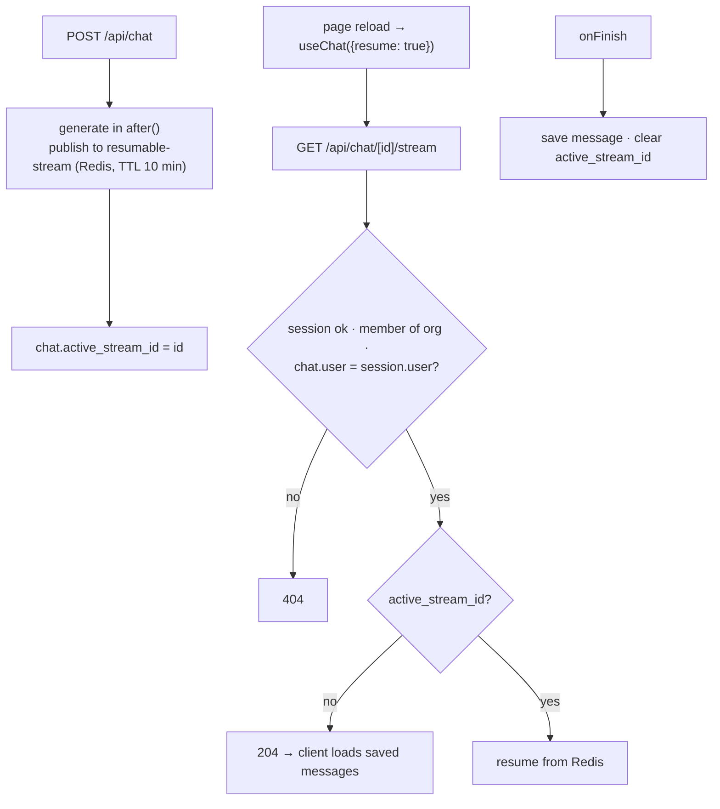

# F8: Resumable Streams & Stop

| Milestone | Priority | Depends on | Effort | Unblocks |
|---|---|---|---|---|
| M3 | Must | F7 | 3 h | F16 |

**Goal:**
- Refresh or reconnect mid-answer and the answer continues.
- Stop works predictably.
- The resume endpoint is **authenticated**.

## Diagram: resume path



## Stop behaviour

Resumable streams and client **abort** don't mix cleanly (a documented AI SDK limitation), so:
1. **Stop** calls a Server Action that sets a stop flag.
2. The generator checks the flag, ends the stream and saves the **partial** message.
3. `active_stream_id` is cleared, so a later reload shows the partial answer instead of resuming.

## Deliverables / files
```
app/api/chat/[id]/stream/route.ts   lib/ai/resumable.ts   lib/ai/stop.ts
```

## Tasks
- [ ] resumable-stream with Upstash; `after()` generation; stream id bookkeeping
- [ ] Authenticated resume endpoint (T3 in the threat model)
- [ ] Stop flag + partial save
- [ ] Degraded mode if Redis is down (no resume, chat still works)

## Acceptance criteria
- E2E: reload mid-answer → full answer, no duplicate message; stop → partial answer kept
- Resume with another org's chat id → 404 (isolation case)

## Tests
- E2E (mock stream with a slow recorded response); isolation case

**Interview talking point:** *"The resume endpoint in the reference setup has no auth; ours checks the
session and chat ownership. Stop is a server-side flag, because client abort breaks resumable streams."*
