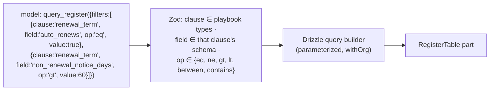
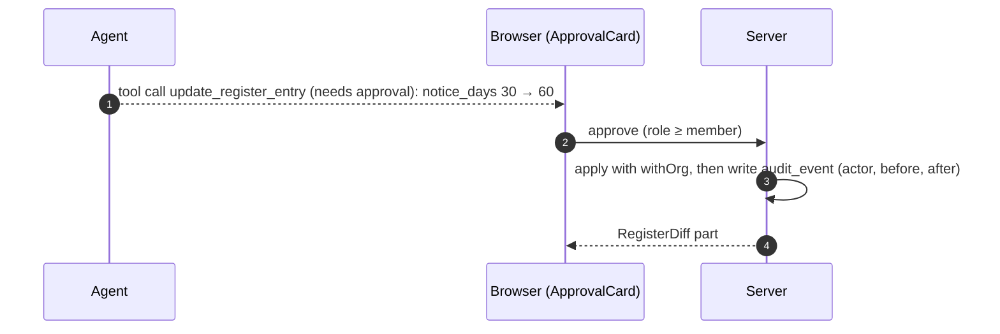

# F9: Register Query Tool & Approvals

| Milestone | Priority | Depends on | Effort | Unblocks |
|---|---|---|---|---|
| M3 | Must | F7 (fixture register rows until F11) | 4 h | F16 |

**Goal:**
- **`query_register`** lets the agent answer questions across contracts from structured data, using an
  allow-listed filter DSL.
- **Write tools** (`update_register_entry`, `flag_for_legal`) wait for the user's approval.

## Diagram: filter DSL (no SQL from the model)



## Diagram: approval



## Deliverables / files
```
lib/ai/tools/query-register.ts   lib/ai/tools/update-register-entry.ts   lib/ai/tools/flag-for-legal.ts
lib/register/filter-dsl.ts       lib/audit/write.ts
components/chat/ApprovalCard.tsx components/chat/RegisterTable.tsx
```

## Tasks
- [ ] Filter DSL with validation against playbook schemas; parameterized queries
- [ ] Approval-gated write tools (per spike S2's outcome); viewers never see approve buttons, and a direct approval call as a viewer returns 403
- [ ] Audit events for approvals, rejections and changes
- [ ] Fixture register rows for development until F11 produces real ones

## Acceptance criteria
- "Which contracts auto-renew with more than 60 days' notice?" returns a correct table (checked against a SQL gold query)
- No register change happens without an approval (E2E approve and reject paths)

## Tests
- DSL fuzz tests (hostile field names, operators, values); E2E approval flows

**Interview talking point:** *"The model never writes SQL. It fills a small typed filter that is validated
against the playbook's schema, and anything that changes data waits for a person to approve the exact
diff."*
