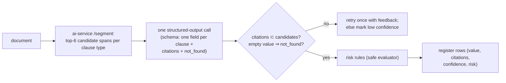

# F10: Playbooks & Extraction Step

| Milestone | Priority | Depends on | Effort | Unblocks |
|---|---|---|---|---|
| M4 | Must | F3, F4 | 5 h | F11, F18 |

**Goal:** Playbook definitions (clause questions + Zod schemas + risk rules) and the **per-document
extraction function** that the workflow will call: candidates → structured output with citations →
verification → risk flags.

## Diagram: one document through extraction



## Deliverables / files
```
lib/playbooks/builtin/vendor-review.ts   # 10 clause types mapped to CUAD
lib/playbooks/schema.ts                  # playbook → combined Zod schema
lib/extraction/extract-document.ts       # the step body (pure given its inputs)
lib/extraction/risk.ts                   # tiny expression evaluator (fields, comparisons, && ||), no eval
```

## Tasks
- [ ] Built-in "Vendor review" playbook (10 CUAD clause types) with schemas and risk rules
- [ ] Extraction with structured outputs (`Output.object`), citations, `not_found`
- [ ] Verification and one guided retry; confidence heuristic
- [ ] Risk evaluator with unit tests (including hostile expressions)
- [ ] Quick check on 5 eval contracts to catch schema/prompt problems early (full evals in F18)

## Acceptance criteria
- `extractDocument` returns schema-valid rows with verified citations for 5 CUAD contracts
- The risk evaluator rejects anything outside its grammar

## Tests
- Unit tests with recorded model outputs; evaluator property tests

**Interview talking point:** *"Extraction returns typed values with citations, and a citation only counts
if it points to a span the retriever actually offered. That's how the register stays checkable."*
