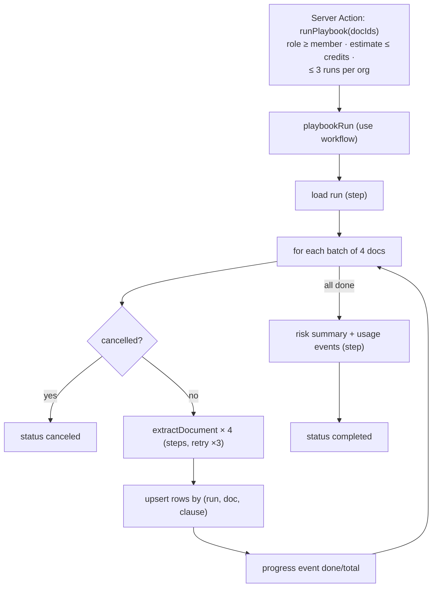

# F11: Playbook Run Workflow

| Milestone | Priority | Depends on | Effort | Unblocks |
|---|---|---|---|---|
| M4 | Must | F10 | 4 h | F12, F14, F18 |

**Goal:** Run a playbook over many documents as a **durable workflow**:
- a credit estimate first;
- batches of 4 documents;
- per-org concurrency limits;
- progress events and cancel;
- idempotent upserts;
- resume after deploys.

## Diagram: workflow shape



## Deliverables / files
```
workflows/playbook-run.ts    app/o/[org]/playbooks/runs/[id]/page.tsx (progress UI)
lib/playbooks/estimate.ts    lib/playbooks/concurrency.ts
```

## Tasks
- [ ] Workflow with steps, retries and parallel batches; per-org concurrency via Redis semaphore
- [ ] Progress streaming to the runs page; cancel action
- [ ] Idempotent upserts; run summary (counts by risk)
- [ ] Usage events per model call (credits in F14)

## Acceptance criteria
- 50-document run completes; forcing a redeploy mid-run still completes with no duplicate rows
- Cancel stops within one batch; rerun only processes unfinished documents

## Tests
- Workflow tests with a fake extractor (fast); E2E run → cancel → rerun (mock model)

**Interview talking point:** *"A 50-contract review is 50 durable steps. I redeployed the app in the middle
of a run, and it continued at the next contract without writing any row twice."*
