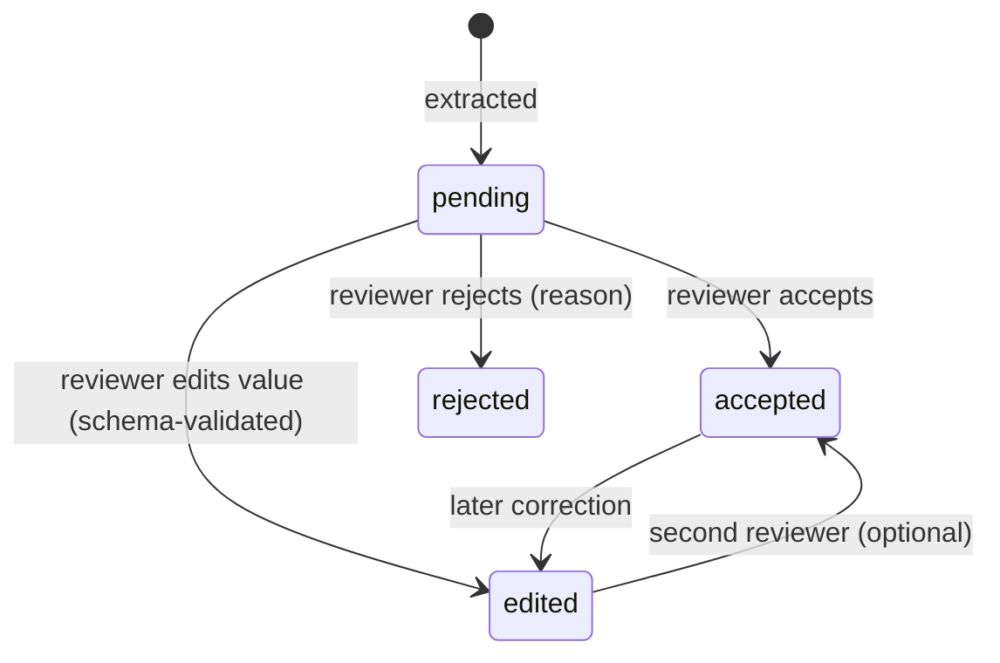
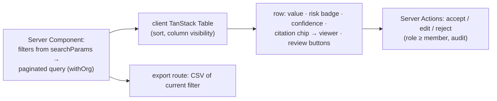

# F12: Clause Register UI & Review

| Milestone | Priority | Depends on | Effort | Unblocks |
|---|---|---|---|---|
| M4 | Must | F11 | 5 h (4 in core: no edit-history view) | F16, F18 |

**Goal:** The clause register as a fast, filterable table with citations and risk flags, where reviewers
**accept, edit or reject** each entry, plus CSV export.

## Diagram: review states



## Diagram: page composition



## Deliverables / files
```
app/o/[org]/register/page.tsx   components/register/*.tsx   app/o/[org]/register/export/route.ts
lib/register/review.ts
```

## Tasks
- [ ] Server-side filters (shared with the F9 DSL) and pagination; indexes for common filters
- [ ] Review actions with schema validation of edits; audit events
- [ ] CSV export (streams; respects filters and role)
- [ ] *(Full plan)* edit-history view per entry

## Acceptance criteria
- 5,000 rows: filter + page < 100 ms server time
- Reviewer changes persist and show who reviewed; viewers can't review (direct-call test)

## Tests
- Component tests for the review controls; E2E accept/edit/reject

**Interview talking point:** *"The AI fills in the register, but people own it. Every value can be accepted,
corrected or rejected, and the evals report how often reviewers had to change something."*
