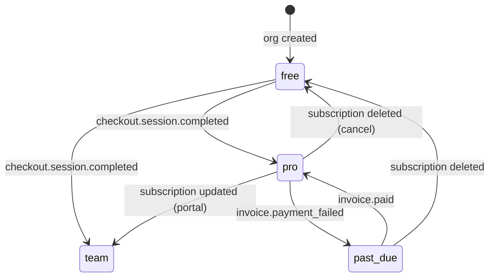
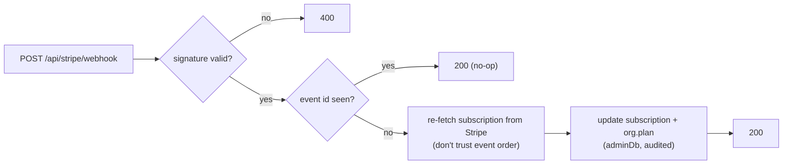

# F13: Stripe Plans & Webhooks

| Milestone | Priority | Depends on | Effort | Unblocks |
|---|---|---|---|---|
| M5 | Must | F1 | 4 h | F14, F16 |

**Goal:** Free / Pro / Team plans in **Stripe test mode**:
- Checkout for upgrades, and the Customer Portal for changes and cancellation.
- Subscriptions attached to the **organization**.
- Webhooks that keep the plan state correct even when events arrive twice or out of order.

## Diagram: plan state



## Diagram: webhook handling



## Deliverables / files
```
lib/billing/stripe.ts          # client, products/prices config (test mode)
lib/auth/server.ts             # + @better-auth/stripe plugin (org as reference id)
app/api/stripe/webhook/route.ts
app/o/[org]/settings/billing/page.tsx   # plan, upgrade, portal link (owner only)
scripts/stripe/bootstrap.ts    # create products, base + metered prices, meter (idempotent)
```

## Tasks
- [ ] Products: Pro and Team, each with a **base price + metered price** (spike S3 outcome)
- [ ] Better Auth Stripe plugin with the organization as the reference; owner-only billing page
- [ ] Webhook: signature, event-id dedupe, re-fetch, state update, audit
- [ ] Credits reset on each billing period

## Acceptance criteria
- Upgrade with a Stripe test card changes the plan after the webhook; portal cancel returns to Free at period end
- Replaying webhooks in random order ends in the correct state (test)

## Tests
- Webhook handler tests with Stripe fixtures; E2E upgrade (Stripe test mode)

**Interview talking point:** *"The webhook handler treats events as hints: it dedupes by id and re-reads
the subscription from Stripe, so duplicates and out-of-order events can't corrupt the plan."*
