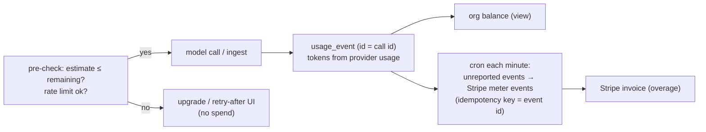

# F14: Metering, Quotas & Rate Limits

| Milestone | Priority | Depends on | Effort | Unblocks |
|---|---|---|---|---|
| M5 | Must | F7, F11, F13 | 4.5 h | F16, F17 |

**Goal:**
- Every model call and ingested page becomes an **idempotent usage event**.
- Credits are checked **before** spending.
- Usage is reported to Stripe meters in batches.
- Rate limits protect the system.
- Users see a clear usage page.

## Diagram: from call to invoice



## Deliverables / files
```
lib/billing/credits.ts       # prices.yaml → credits; estimate()
lib/billing/usage.ts         # record(); balance()
lib/billing/report-job.ts    # cron route (Vercel Cron) → Stripe meter events
lib/billing/ratelimit.ts     # Upstash sliding windows (chat per user, runs + uploads per org)
app/o/[org]/settings/usage/page.tsx   # usage by day, by feature, remaining credits
```

## Tasks
- [ ] Credit model from `prices.yaml` (per model, input/output/cached tokens; pages)
- [ ] Pre-checks in `/api/chat`, upload and playbook start; clear UI for blocked actions
- [ ] Usage events from AI SDK `onFinish` usage and workflow steps; idempotent ids
- [ ] Reporting cron with retries and a reconciliation query
- [ ] Rate limits; `429` + `Retry-After`

## Acceptance criteria
- A Free org at 0 credits can't start a chat turn or a run, and no model call is made (verified by mock provider call count)
- Reported meter quantities equal recorded credits after retries (feeds F17)

## Tests
- Unit: credit maths, estimate bounds; integration: cron idempotency with Stripe test mode

**Interview talking point:** *"Usage is recorded from the provider's own token counts with idempotent ids,
checked before every call, and reported to Stripe in batches, so a customer can't overspend and is never
billed twice."*
