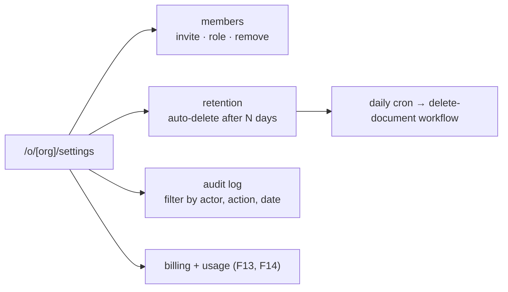

# F15: Settings & Audit Log Pages

| Milestone | Priority | Depends on | Effort | Unblocks |
|---|---|---|---|---|
| M5 | Should · **deferred in the core plan** | F1 | 3 h | Admin completeness |

**Goal:** Full organization settings (members, roles, invitations, retention) and an **audit log viewer**
for admins. Audit events are already written from F4/F9/F11/F13; this adds the pages.

## Diagram: settings area

## Tasks
- [ ] Members page (beyond F1's basic list): pending invitations, resend, revoke
- [ ] Retention setting + daily cron using the F4 delete workflow
- [ ] Audit log table (admin+), with filters and CSV export

## Acceptance criteria
- Admin sees all audit events for the org; a member gets 403 on the page and the export

**Interview talking point:** *"Every sensitive action already writes an audit event. This page just makes
it visible to the customer's admins."*
