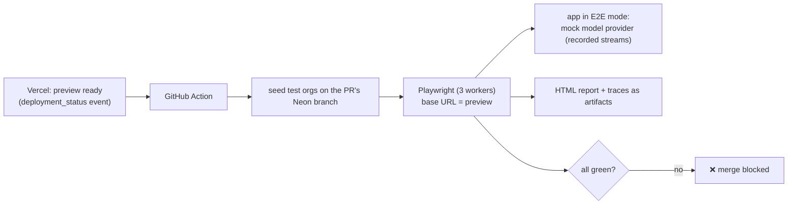

# F16: E2E on Previews

| Milestone | Priority | Depends on | Effort | Unblocks |
|---|---|---|---|---|
| M6 | Must | F8, F12, F14 | 5 h | F19, F20 |

**Goal:** Complete the Playwright suite from [04 §4.4](../04-evaluation-design.md#44-end-to-end-tests-playwright-on-every-preview)
and run it against **every PR's preview deployment**, with mocked models and Stripe test mode.

## Diagram: test run



## Flows covered

| Flow | Key assertions |
|---|---|
| Sign-up → org → invite → accept | Roles, org switch |
| Upload → ingestion statuses | Streamed status changes |
| Chat → citation → viewer | Highlight visible at the right page |
| **Reload mid-answer** | Resume completes, no duplicate |
| Stop | Partial answer saved |
| Playbook run → cancel → rerun | Progress, no duplicate rows |
| Approval approve / reject | Register changes only on approve; audit row |
| Viewer role | No upload/run buttons; direct action call → 403 |
| Upgrade with test card | Plan updates after webhook; usage page |
| Out of credits | Chat blocked with upgrade prompt; no model call |

## Deliverables / files
```
e2e/*.spec.ts   e2e/fixtures/recorded-streams/*.json   .github/workflows/e2e-preview.yml
lib/ai/models.ts  # E2E_MODE switch to the mock provider (server-only, never in production)
```

## Tasks
- [ ] Recorded streams for the chat and extraction flows; E2E mode guarded so it can't be enabled in production
- [ ] Workflow triggered on preview deployment; artifacts uploaded
- [ ] Nightly job: 3 flows with real models on staging

## Acceptance criteria
- Suite ≤ 10 minutes; green on main for 5 consecutive PRs (flake check)

**Interview talking point:** *"Every pull request is tested end to end on its own deployed copy, including
refreshing mid-answer and paying with a test card, with recorded model streams so the tests are fast and
deterministic."*
