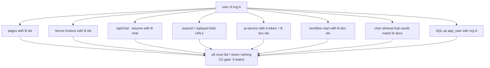
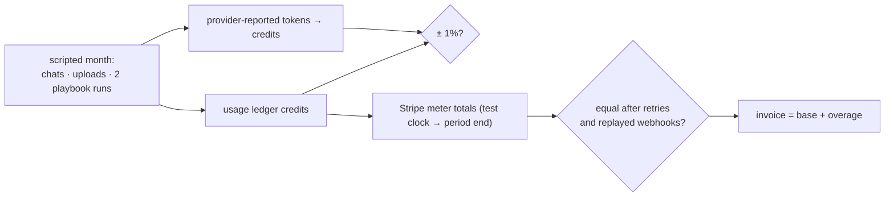

# F17: Isolation & Billing Suites

| Milestone | Priority | Depends on | Effort | Unblocks |
|---|---|---|---|---|
| M6 | Must | F2, F14 | 3.5 h | F20 |

**Goal:** Finish the **tenant isolation suite** (every path, 0 leaks) and the **billing reconciliation**
run with a Stripe test clock.

## Diagram: isolation matrix



## Diagram: billing reconciliation



## Deliverables / files
```
tests/isolation/*.spec.ts        # Playwright + API + SQL cases (grown since F2)
evals/billing/reconcile.ts       # test-clock scenario + checks
reports/isolation.md  reports/billing.md
```

## Tasks
- [ ] Fill every path in the matrix; run in CI on each preview
- [ ] Test-clock scenario, forced retries and replayed webhooks; reconciliation checks
- [ ] Short reports

## Acceptance criteria
- 0 leaks across all paths; billing matches within 1% and meters equal the ledger

**Interview talking point:** *"The isolation suite tries every path from pages to the Python service to raw
SQL as another tenant, and a single leak fails the build."*
