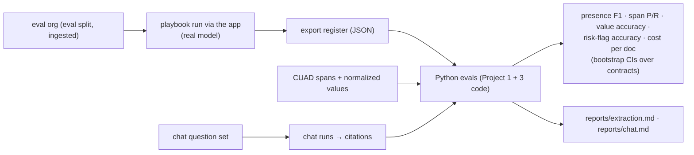

# F18: Evals: CUAD Extraction & Chat

| Milestone | Priority | Depends on | Effort | Unblocks |
|---|---|---|---|---|
| M6 | Must | F6, F7, F11 | 5 h (3.5 in core: 30 contracts, one model, 30 chat questions) | F20 |

**Goal:** Measure extraction quality on CUAD and chat grounding, with confidence intervals, and a small
smoke version for PRs.

## Diagram: eval pipeline



## Deliverables / files
```
evals/cuad/run.ts            # triggers runs via the app against the eval org
evals/cuad/score.py          # metrics + bootstrap (reuses Project 3 stats)
evals/chat/questions.jsonl   evals/chat/score.py   # Project 1 citation metrics
evals/smoke/*                # 5 contracts × 10 clauses, 10 questions, cheap model (CI)
```

## Tasks
- [ ] Ingest the eval split into a dedicated eval org
- [ ] Extraction metrics per clause type; X2 experiment (one call vs per-clause) on the core set
- [ ] Chat question set (single-doc, register, unanswerable, injection-bearing) and scoring
- [ ] Smoke eval in CI with the "drop > 10 points blocks" rule
- [ ] *(Full plan)* X1: second model; 60 contracts; X4 human-review impact study

## Acceptance criteria
- `reports/extraction.md` with per-clause F1 and CIs; `reports/chat.md` with citation precision/recall and abstention accuracy

**Interview talking point:** *"On CUAD, lawyer-labelled contracts, extraction reached __ F1 across 10 clause
types. The weakest was __, which is why that clause gets a mandatory review flag in the product."* (Fill in.)
