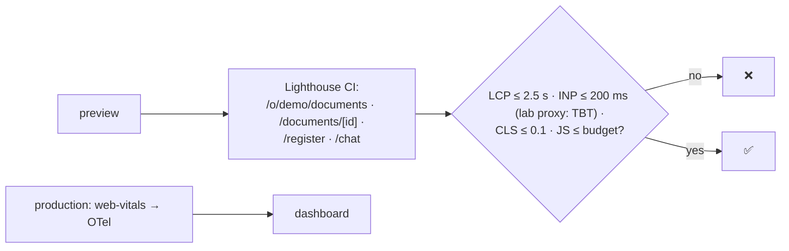

# F19: Performance & Observability

| Milestone | Priority | Depends on | Effort | Unblocks |
|---|---|---|---|---|
| M6 | Must | F16 | 3 h (2 in core: no k6) | F20 |

**Goal:** Enforce Core Web Vitals and chat latency budgets, and make every request traceable in Langfuse.

## Diagram: budgets in CI

## Tasks
- [ ] `@vercel/otel` + `@langfuse/otel`; AI SDK telemetry on; `traceparent` to the ai-service
- [ ] Server timing for TTFT; a 50-sample TTFT measurement on staging (real model)
- [ ] Lighthouse CI budgets on key pages; bundle-size budget for the chat route
- [ ] Real-user Web Vitals reporting in production
- [ ] *(Full plan)* k6: 50 concurrent chat streams against the mock provider

## Acceptance criteria
- Budgets pass on previews; TTFT p95 ≤ 1.5 s reported; one trace shows browser → Next.js → ai-service → model

**Interview talking point:** *"Performance is a CI check, not a hope: Lighthouse budgets run on every
preview, and time to first token is traced from the browser to the model."*
