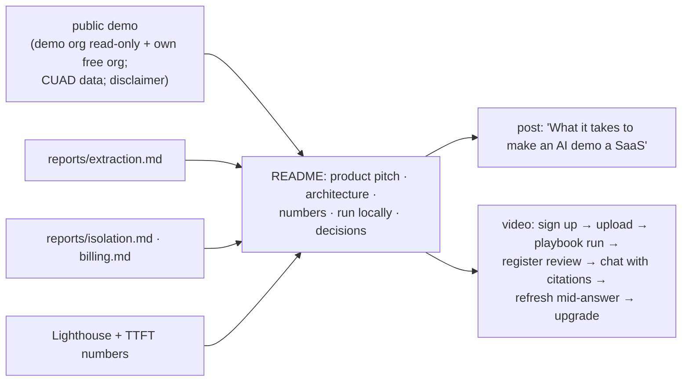

# F20: Launch, Report, Blog & Video

| Milestone | Priority | Depends on | Effort | Unblocks |
|---|---|---|---|---|
| M6 | Must | F16–F19 | 4 h (3.5 in core) | Job applications |

**Goal:** A public demo with a marketing page, a README that reads like a product case study, a post and a
3-minute video.

## Diagram: what gets published where

## Tasks
- [ ] Marketing page (static), pricing (test-mode note), legal disclaimer, CUAD attribution
- [ ] Production deploy: Vercel prod + Neon main + ai-service prod revision; spend limits set
- [ ] README with architecture, numbers (each linked to its report and commit), trade-offs
- [ ] Post and 3-minute video
- [ ] Update the résumé bullet template in `03-projects.md` with real numbers

## Acceptance criteria
- A stranger completes sign-up → playbook → chat in under 5 minutes on the public demo

**Interview talking point:** *"The demo is a real SaaS you can sign up for. The README shows the numbers
behind it: extraction F1, zero isolation leaks, billing within 1%, and page-speed budgets."*
