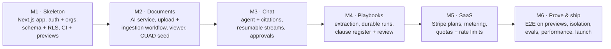
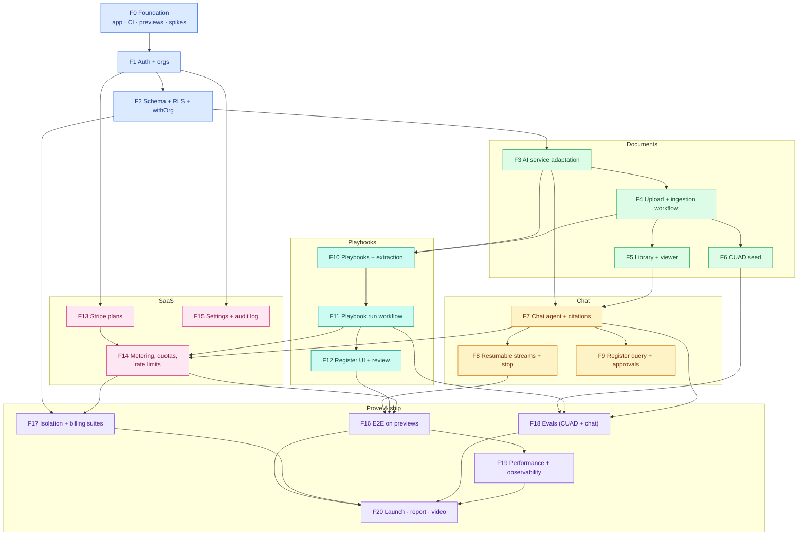
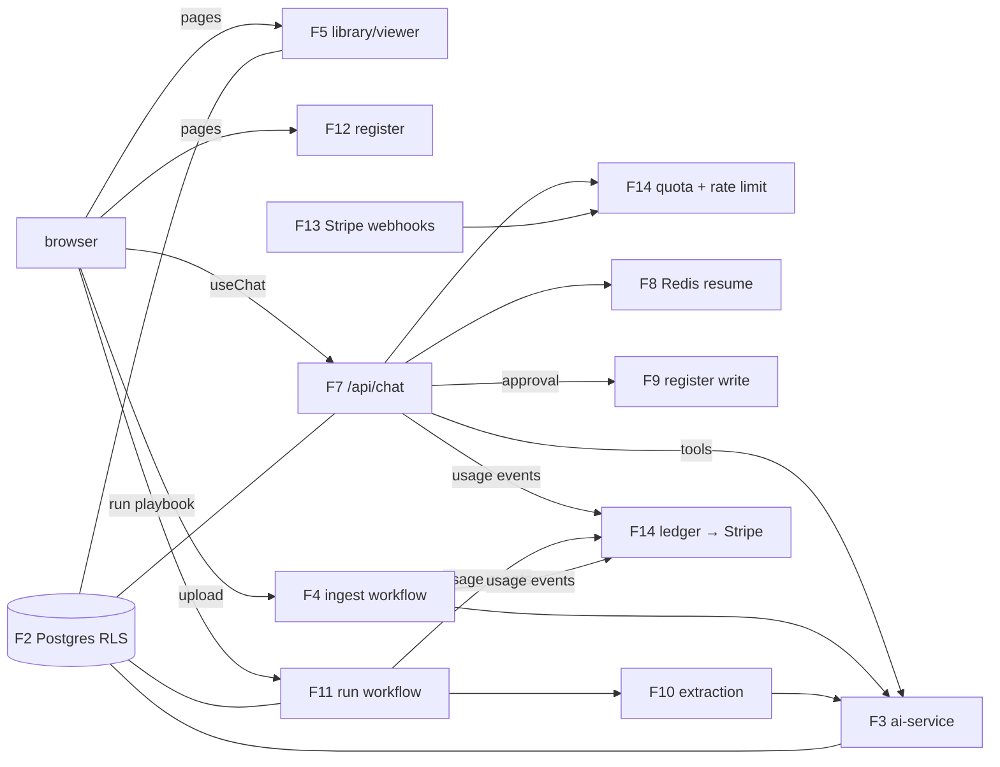
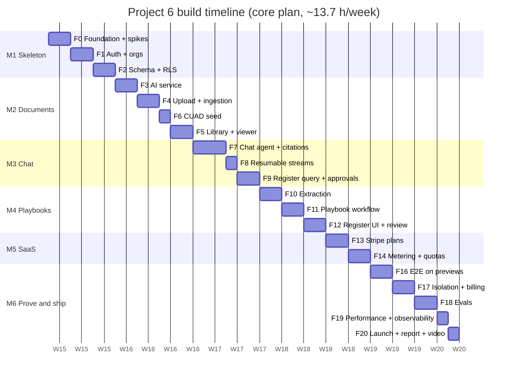

# 9. Build Plan: Feature by Feature

This plan splits Project 6 into **21 features** (F0–F20), grouped into **6 milestones**. Every feature has
its own page with diagrams, files, tasks, acceptance criteria, tests, an estimate and an interview
talking point.

## 9.1 Build strategy: tenant-safe skeleton first, then documents, chat, playbooks, money, proof

Six rules:
1. **Tenancy from the first table.** RLS, `withOrg` and the lint rule exist before any feature table.
   An isolation test lands with every new table or endpoint.
2. **Previews from day one.** Every PR gets a Vercel preview and a Neon branch from F0. E2E grows
   feature by feature, and F16 only fills the gaps.
3. **Mock models by default.** UI, E2E and most tests use recorded model streams. Real models run only in
   evals and nightly smoke tests.
4. **Server Actions are endpoints.** Each one has a direct-call test for auth and role.
5. **Anything slow is a workflow.** Nothing long-running is started as a floating promise in a request.
6. **Each feature ends with a PR, a green preview and a `CHANGELOG.md` entry.**

## 9.2 Master diagram: how the features connect

Arrows mean **"is required by"** (build the source first). Colours show milestones.

**Legend:** blue = M1 Skeleton · green = M2 Documents · amber = M3 Chat · teal = M4 Playbooks ·
pink = M5 SaaS · purple = M6 Prove & ship. **F15 is deferred in the chosen core plan** (§9.5).
Audit events are still written from F9 onwards; only the settings and audit pages wait.

## 9.3 Runtime integration map

## 9.4 Feature index

| ID | Feature | Milestone | Priority | Depends on | Effort (h) | Page |
|---|---|---|---|---|---|---|
| F0 | Foundation, CI, previews & spikes | M1 | Must | — | 4 | [F00](F00-foundation.md) |
| F1 | Auth & organizations | M1 | Must | F0 | 5 | [F01](F01-auth-orgs.md) |
| F2 | Schema, RLS & `withOrg` | M1 | Must | F1 | 4 | [F02](F02-schema-rls.md) |
| F3 | AI service adaptation | M2 | Must | F2 | 4 | [F03](F03-ai-service.md) |
| F4 | Upload & ingestion workflow | M2 | Must | F3 | 5 | [F04](F04-upload-ingestion.md) |
| F5 | Document library & viewer | M2 | Must | F4 | 5 | [F05](F05-library-viewer.md) |
| F6 | CUAD seed & eval split | M2 | Must | F4 | 2 | [F06](F06-cuad-seed.md) |
| F7 | Chat agent & citations | M3 | Must | F3, F5 | 7 | [F07](F07-chat-agent.md) |
| F8 | Resumable streams & stop | M3 | Must | F7 | 3 | [F08](F08-resumable-streams.md) |
| F9 | Register query tool & approvals | M3 | Must | F7 (fixture register rows until F11) | 4 | [F09](F09-register-query-approvals.md) |
| F10 | Playbooks & extraction step | M4 | Must | F3, F4 | 5 | [F10](F10-playbooks-extraction.md) |
| F11 | Playbook run workflow | M4 | Must | F10 | 4 | [F11](F11-playbook-workflow.md) |
| F12 | Clause register UI & review | M4 | Must | F11 | 5 (4 in core) | [F12](F12-register-ui.md) |
| F13 | Stripe plans & webhooks | M5 | Must | F1 | 4 | [F13](F13-stripe-plans.md) |
| F14 | Metering, quotas & rate limits | M5 | Must | F7, F11, F13 | 4.5 | [F14](F14-metering-quotas.md) |
| F15 | Settings & audit log pages | M5 | Should · **deferred** | F1 | 3 | [F15](F15-settings-audit.md) |
| F16 | E2E on previews | M6 | Must | F8, F12, F14 | 5 | [F16](F16-e2e-previews.md) |
| F17 | Isolation & billing suites | M6 | Must | F2, F14 | 3.5 | [F17](F17-isolation-billing.md) |
| F18 | Evals: CUAD extraction & chat | M6 | Must | F6, F7, F11 | 5 (3.5 in core) | [F18](F18-evals.md) |
| F19 | Performance & observability | M6 | Must | F16 | 3 (2 in core) | [F19](F19-performance-observability.md) |
| F20 | Launch, report, blog & video | M6 | Must | F16–F19 | 4 (3.5 in core) | [F20](F20-launch.md) |
| | **Total: full plan / core plan (chosen)** | | | | **~89 h / ~82 h** | |

## 9.5 Timeline: Option B (core plan) chosen

The roadmap originally gave Project 6 **3 weeks** (weeks 28–30). This is the main full-stack project, so the design is
the biggest yet:

| Option | Scope | Effort | Weeks at ~13.7 h/week |
|---|---|---|---|
| A. Full plan | All 21 features | ~89 h | ~6.5 |
| **B. Core plan ✅ chosen** | Everything that makes it a real SaaS: orgs + RLS, durable ingestion and playbooks, chat with citations + resume + approvals, register review, Stripe + metering + quotas, E2E on previews, isolation + billing suites, CUAD evals. **Deferred:** F15 settings/audit pages. **Slimmed:** evals (30 CUAD contracts, one model), no k6 load test, no register edit-history view | **~82 h** | **6** |
| C. Lean | B without Stripe (metering + quotas only, "billing-ready"), without tool approvals, register read-only, page-level highlights only, a smaller E2E set | ~70 h | ~5 |

**Why B:**
- Stripe billing, tool approvals and register review are exactly what separates a SaaS from a demo, and
  they are the items AI Full-stack JDs ask about.
- The capstone reuses this app shell, so time spent here is not lost.
- C saves 12 h but removes the billing story.

**Roadmap impact (applied):** P6 grows from 3 to 6 weeks (roadmap weeks 28–33), which adds **3 weeks** and
takes the [roadmap](../../../../04-roadmap.md) from ~39 to **~42 weeks (about 9.7 months)**. *(Project 5's plan later took it to ~44 weeks.)*
**Cumulative note:** the roadmap started at 26 weeks. Every detailed plan so far has grown, which is
normal once designs are concrete. If you want to hold the total nearer 9 months, C here (and later the
lean options for P5, P7 and the capstone) is the lever.

**Core plan, week by week** (roadmap weeks 28–33)

| Week | Roadmap week | Milestone | Features | Exit check |
|---|---|---|---|---|
| 1 | 28 | M1 | F0 foundation + spikes · F1 auth + orgs · F2 schema + RLS | Sign up → org → invite works on a preview; RLS unit tests pass |
| 2 | 29 | M2 | F3 AI service · F4 upload + ingestion · F6 CUAD seed · F5 (start) | 50 CUAD contracts ingested through the workflow into the demo org |
| 3 | 30 | M2 → M3 | F5 viewer (finish) · F7 chat agent · F8 resumable streams · F9 (start) | **Chat answers with clickable, highlighted citations; refresh mid-answer resumes** |
| 4 | 31 | M3 → M4 | F9 approvals (finish) · F10 extraction · F11 playbook workflow · F12 (start) | A 50-document playbook run survives a redeploy; approvals change the register |
| 5 | 32 | M4 → M5 | F12 register review · F13 Stripe · F14 metering + quotas · F16 (start) | Upgrade in Stripe test mode; out-of-credit blocks calls before any model spend |
| 6 | 33 | M6 | F16 E2E · F17 isolation + billing · F18 evals · F19 performance · F20 launch | Green E2E on previews; 0 leaks; CUAD report; public demo + post |

*(Dates are illustrative: Project 6 starts after Project 4's 4 weeks. One "d" is one working session of
about 2–2.5 hours. F9 is built against fixture register rows; real rows arrive with F11.)*

**Deferred in B (~7 h)**

| Item | Effort | Value when added |
|---|---|---|
| F15 Settings pages + audit log viewer | 3 h | Admin completeness; compliance story |
| Evals: second model (X1) + 30 more contracts | 1.5 h | Model comparison, tighter CIs |
| k6 load test | 1 h | Concurrency numbers |
| Register edit-history view | 1 h | Review traceability in the UI |
| Launch polish | 0.5 h | — |

## 9.6 Milestone exit criteria

| Milestone | Done when |
|---|---|
| **M1 Skeleton** | Sign up, verify email, create org, invite and accept, switch org, all on a preview deployment with its own Neon branch. RLS policies on all tables; `withOrg` is the only DB path; first isolation tests pass. |
| **M2 Documents** | Upload → durable ingestion (statuses stream) → document viewable with page rendering. The ai-service enforces the org from the service JWT. 50 CUAD contracts seeded in the demo org; the eval test split stays separate. |
| **M3 Chat** | Streaming answers with verified citations that open the viewer at the highlighted span; refresh mid-answer resumes; stop works; register questions render a table part; write tools wait for approval. |
| **M4 Playbooks** | The "Vendor review" playbook runs over 50 documents as a workflow with progress and cancel, survives a forced redeploy, writes idempotent register rows with risk flags; reviewers accept, edit and reject entries; CSV export. |
| **M5 SaaS** | Free → Pro upgrade via Stripe Checkout (test mode); webhooks update the plan; usage ledger → batched meter events; quotas and rate limits block before any model call. |
| **M6 Prove & ship** | E2E green on previews (including resume, cancel, approval, upgrade); 0 isolation leaks; billing reconciliation within 1%; CUAD report; Lighthouse budgets met; public demo, README, post and video. |

## 9.7 Definition of done (every feature)

- [ ] PR with a green preview deployment (own Neon branch)
- [ ] Typecheck, lint (including the no-raw-DB rule), Vitest green
- [ ] Every new Server Action / route handler has a direct-call auth test
- [ ] Every new tenant table or endpoint has an isolation test case
- [ ] E2E updated for any new user-visible flow (mocked models)
- [ ] No secrets in client bundles (build check), no tokens in logs
- [ ] Docs updated (this plan's checkboxes, the setup guide, `CHANGELOG.md`)

## 9.8 Risk register

| Risk | Impact | Mitigation |
|---|---|---|
| AI SDK 7 / Workflow SDK APIs still moving | Rework | Pin versions; spikes in F0; wrap SDK calls in thin local modules |
| RLS over the Neon WebSocket Pool on Vercel is slow or flaky | Isolation design | F0 spike; fallback `pg` Pool via Neon's pooled endpoint ([08 §8.6](../08-tech-stack.md#86-things-to-verify-in-the-first-week-of-building)) |
| Tool approval + resumable streams interplay | Chat UX | Spike; fallback: approval ends the turn, execution in the next request |
| Better Auth Stripe plugin + metered price | Billing | Base + metered plans; Stripe SDK directly for the metered item if needed |
| Docling bbox → pdf.js highlight mismatch | Citation UX | Page-level highlight + snippet fallback |
| Preview environments need many services (Neon branch, ai-service staging, Redis, Blob) | Flaky previews | Preview env template; shared staging ai-service; seeded branch from a template branch |
| Scope creep (custom playbooks, SSO, redlining, mobile) | Timeline | Out-of-scope list in [01 §1.7](../01-requirements.md#17-scope) is binding |
| Plan longer than the roadmap slot | Later projects slip | **Option B chosen** (6 weeks); roadmap updated; deferred pages added only while interviewing |
