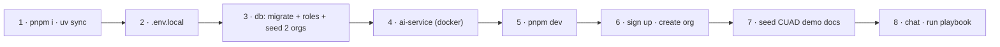

# 10. Setup Guide: accounts, keys and the first run

> **Status:** No code exists yet. This page is the **target setup**: commands become real as F0–F7 are
> built and may change slightly. Keep it in sync with the repo.

## 10.1 What you need, and when

| Needed from | Tool / account | Used for | Cost |
|---|---|---|---|
| **M1** | Node 24 LTS + **pnpm**, Git, Docker (for the ai-service and local Postgres) | App + service | Free |
| M1 | **Vercel** account (Hobby) linked to the GitHub repo | Previews, workflows, blob | Free for a portfolio demo |
| M1 | **Neon** account (free tier) with a `seeded` template branch | Postgres + branches | Free |
| M1 | **Upstash** Redis (free tier) | Resumable streams, rate limits | Free |
| M1 | **Resend** account + a verified sender domain (or their test domain) | Verification + invite emails | Free tier |
| M1 | **Google OAuth** client (web) | Sign in with Google | Free |
| **M2** | Everything from Project 1's setup for the ai-service (Python 3.12, uv, embedding keys) + **Azure** (Container Apps) | ai-service staging/prod | Low with scale to zero |
| M3 | **Anthropic** and **OpenAI** API keys | Chat + extraction | Pay per use (set limits) |
| M3 | **Langfuse** (same account as earlier projects) | Traces | Free tier |
| **M5** | **Stripe** account in **test mode** + Stripe CLI | Plans, meters, webhooks locally | Free (test mode) |
| M6 | Lighthouse CI (npm), Playwright browsers (preinstalled in CI images) | Budgets, E2E | Free |

## 10.2 Environment variables (`apps/web/.env.local`)

```bash
# --- Database (M1) ---
DATABASE_URL=postgres://app_user:…@…neon.tech/clausedesk?sslmode=require        # pooled, app role
DATABASE_URL_DIRECT=postgres://owner:…@…neon.tech/clausedesk?sslmode=require     # migrations only

# --- Auth (M1) ---
BETTER_AUTH_SECRET=<random 32 bytes>
BETTER_AUTH_URL=http://localhost:3000
GOOGLE_CLIENT_ID=
GOOGLE_CLIENT_SECRET=
RESEND_API_KEY=

# --- Redis / Blob (M1–M2) ---
UPSTASH_REDIS_REST_URL=
UPSTASH_REDIS_REST_TOKEN=
BLOB_READ_WRITE_TOKEN=

# --- AI service (M2) ---
AI_SERVICE_URL=http://localhost:8000
AI_SERVICE_JWT_KEYS='{"2027-04":"<random 32 bytes, base64>"}'   # same ring configured in the service

# --- Models (M3) ---
ANTHROPIC_API_KEY=
OPENAI_API_KEY=
E2E_MODE=0                                   # 1 only in test runs: mock model provider

# --- Tracing (M3) ---
LANGFUSE_PUBLIC_KEY=
LANGFUSE_SECRET_KEY=
LANGFUSE_HOST=https://cloud.langfuse.com

# --- Billing (M5, test mode) ---
STRIPE_SECRET_KEY=sk_test_…
STRIPE_WEBHOOK_SECRET=whsec_…               # from `stripe listen`
STRIPE_METER_EVENT_NAME=clausedesk_credits
```

**Never prefix secrets with `NEXT_PUBLIC_`.** Server modules import `server-only`, so a leak fails the build.

## 10.3 First run



```bash
pnpm install && (cd services/ai && uv sync)
pnpm db:migrate && pnpm db:roles && pnpm db:seed         # owner connection
docker compose up ai-service                            # or: uv run uvicorn app.main:app
pnpm dev                                                # http://localhost:3000
pnpm cuad:download && pnpm cuad:seed-demo               # after creating the demo org
stripe listen --forward-to localhost:3000/api/stripe/webhook   # when working on M5
pnpm stripe:bootstrap                                   # products, prices, meter (test mode)
```

## 10.4 Keeping costs safe

| Control | Setting |
|---|---|
| Mock models | `E2E_MODE=1` for E2E and most UI work; real models only for evals and manual checks |
| Provider limits | Monthly spend caps in the Anthropic and OpenAI consoles |
| App quotas | The Free plan's credits apply to your own dev org too |
| Stripe | Test mode only; never add live keys to this project |
| Neon | Branches deleted on PR close; free-tier compute auto-suspends |
| Azure | ai-service scales to zero; budget alert on the resource group |

## 10.5 Troubleshooting

| Symptom | Likely cause | Fix |
|---|---|---|
| Queries return nothing for your own org | `app.org_id` not set (query outside `withOrg`) or the wrong role | Use `withOrg`; check the lint rule; connect as `app_user` |
| "Transactions not supported" errors | HTTP driver used for tenant data | Use the WebSocket `Pool` driver ([08 §8.3](08-tech-stack.md#data)) |
| Resume returns 204 immediately | Stream finished or `active_stream_id` cleared | Expected; the client loads saved messages |
| Webhooks not arriving locally | `stripe listen` not running or wrong secret | Restart `stripe listen`; copy the new `whsec_` |
| Preview can't reach the database | Neon branch job failed or env not injected | Re-run the branch workflow; check the preview env |
| ai-service 401 | JWT key ring mismatch or clock skew | Same `kid`/key on both sides; sync time |
| Highlights misaligned | bbox units vs pdf.js viewport scale | Normalize bboxes to page size; see F5's fallback |
