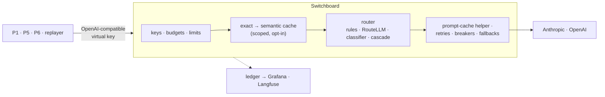

# Project 7: LLM Gateway & Cost Router (Switchboard)

> **Switchboard** is a small, supply-chain-hardened LLM gateway that Projects 1, 5 and 6 route their
> model calls through. It has an OpenAI-compatible API, virtual keys, budgets, retries, fallbacks and
> circuit breakers, **three cache layers** (provider prompt caching, exact, and tenant-scoped semantic)
> and **five routing policies**. Every saving is measured against its quality cost, false-hit rate and
> poisoning risk.

**Target roles:** GenAI Engineer (primary), AI Platform / Full-stack
**Gaps it closes:** cost and latency engineering, semantic caching (done safely), model routing, gateway
reliability patterns, FinOps dashboards, OTel metrics, supply-chain security for AI infrastructure
**Status:** 🟡 System design and tech stack done (no code yet). Build plan and setup guide come next.
**Builds on:** [Project 1](../01-rag-eval-lab/README.md) (eval sets, graders) · [Project 6](../06-ai-saas-nextjs/README.md) (ClauseDesk traffic, CUAD graders) ·
[Project 3](../03-agent-reliability-harness/README.md) (agent traces, statistics) · [Project 4](../04-a2a-agent-mesh/README.md) (Toxiproxy fault tests)

> **New here?** Start with [0 · Start here](docs/00-start-here.md): the project in plain English, one
> request's journey, and which document to read next.

## Design documents

| # | Document | What it answers |
|---|---|---|
| 0 | [Start Here](docs/00-start-here.md) | The project in plain English, a request's journey, reading paths, FAQ |
| 1 | [Requirements](docs/01-requirements.md) | Components, use cases, functional and non-functional requirements, success criteria, scope |
| 2 | [High-Level Architecture](docs/02-architecture.md) | Context, containers, request pipeline, fallback flow, semantic cache flow, cascade, deployment |
| 3 | [Low-Level Design](docs/03-low-level-design.md) | Data model, API, provider translation, prompt-cache helper, cache keys and scopes, routing policies, router training, reliability defaults, cost maths |
| 4 | [Evaluation Design](docs/04-evaluation-design.md) | Trace-replay workloads, configurations C0–C6, semantic-cache study + poisoning tests, routing Pareto curves, reliability, overhead, build-vs-buy |
| 5 | [Security & Threat Model](docs/05-security-threat-model.md) | Gateway threats → controls → tests, the LiteLLM March 2026 incident as a design input, OWASP mapping |
| 6 | [Non-Functional Design](docs/06-non-functional.md) | Latency budget, throughput, running cost, metrics and dashboards, failure modes |
| 7 | [Architecture Decision Records](docs/07-decisions.md) | 11 decisions with alternatives and consequences |
| 8 | [Tech Stack](docs/08-tech-stack.md) | Official SDKs, Redis + Lua, pgvector, local ONNX embeddings and router, offline RouteLLM, in-house reliability, supply-chain controls, versions, week-1 checks |
| 11 | [Glossary](docs/11-glossary.md) | Gateway, caching, routing and security terms in plain English |

Numbers 9, 10 and 12 are reserved for the build plan, setup guide and market review, matching
Projects 1–6.

## The system at a glance

## Planned deliverables
1. The Switchboard gateway (containers + Terraform), with the admin CLI and Grafana dashboards
2. **Cost report:** cost per 1k requests for C0–C6 on three real workloads, with quality changes and CIs
3. **Semantic cache study:** hit vs false-hit curves, thresholds per app, poisoning attacks off vs on
4. **Routing report:** Pareto curves for five policies against an oracle
5. **Reliability demo** and **build-vs-buy** table (vs LiteLLM proxy and a managed gateway)
6. ClauseDesk switched to the gateway: before/after cost; a post and a 3-minute video

## Résumé bullet template
"Built an LLM gateway (FastAPI, Redis, pgvector) with budgets, fallbacks, prompt/exact/semantic caching
and learned routing; cut cost per 1k requests by __% at < __ points of quality loss on real workloads,
with a measured semantic-cache false-hit rate of __% and poisoning defences."
