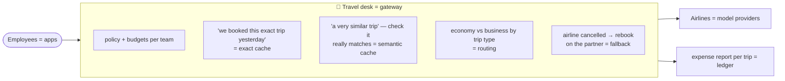

# 0. Start Here: the project in plain English

New to these docs, or preparing for an interview? Read this page first. Unfamiliar terms are explained in
the [glossary](11-glossary.md).

## 0.1 The project in three sentences

1. **Switchboard** is a small gateway that sits between your apps and the AI model providers. Apps call
   one URL with their own key, and the gateway handles budgets, rate limits, retries, fallbacks when a
   provider is down, and a record of what every request cost.
2. It tries to **spend less** in three ways, and measures each one:
   - making sure the providers' own prompt caching works;
   - answering repeated or near-identical questions from a cache;
   - sending easy requests to a cheaper model.
3. Every saving is weighed against what it risks: quality loss (measured with the graders from Projects 1
   and 6), wrong cache answers, and cache poisoning. The whole thing is built to be hard to compromise,
   because a gateway sees every key and every prompt.

## 0.2 Which path should you read?

| You want to… | Read, in this order | Time |
|---|---|---|
| Explain the project in an interview | This page → [Evaluation](04-evaluation-design.md) → [Decisions](07-decisions.md) | 30 min |
| Understand the design | [Requirements](01-requirements.md) → [Architecture](02-architecture.md) → [Low-level design](03-low-level-design.md) | 45 min |
| Understand the security story | [Security](05-security-threat-model.md) | 10 min |
| Understand performance and operations | [Non-functional design](06-non-functional.md) | 10 min |
| Start building | The tech stack, build plan and setup guide come next (not written yet) | — |

## 0.3 The mental model: a company's travel desk

| Travel-desk idea | Real component | Why it matters |
|---|---|---|
| Company card per team, with a limit | Virtual keys + budgets | Nobody can overspend, and every cost has an owner |
| Re-using an identical booking | Exact cache | Free and instant for true repeats |
| Re-using a *similar* booking | Semantic cache | Cheap, but a wrong match sends someone to the wrong city, so it's checked and measured |
| Economy for short hops | Routing to a smaller model | Big savings if chosen well; quality loss if chosen badly |
| Rebooking on a partner airline | Fallbacks + circuit breakers | A provider outage doesn't take your app down |
| Expense reports | Ledger + dashboards | Cost per request, per team, per feature |

## 0.4 One request's journey

| Step | What happens |
|---|---|
| 1 | ClauseDesk sends a chat request to Switchboard with model `smart` and its virtual key |
| 2 | Key checked, rate limit ok, **$0.004 reserved** from the team's daily budget |
| 3 | Exact cache: miss (it's a new question). Semantic cache: off for this app (legal data → opted out) |
| 4 | Router: `smart` → Claude mid-tier; the prompt-cache helper marks the long system prompt + tool definitions as cacheable |
| 5 | Anthropic is overloaded → one retry → still overloaded → **fallback** to the OpenAI mid-tier model (supports the same tools) |
| 6 | Tokens stream back to ClauseDesk; usage arrives: 6,100 input (5,800 cached), 420 output |
| 7 | Ledger row: $0.0031 actual, reservation settled, `x-fallback: 1`; Grafana shows the fallback spike |

## 0.5 What makes this project stand out in interviews

- **Savings with a price tag:** every cost feature has a measured quality impact and confidence interval,
  not a vendor claim.
- **The cache risks nobody talks about:** false hits and 2026-style cache poisoning, measured and defended.
- **Routing done like research:** five policies on Pareto curves against an oracle, trained on your own
  projects' eval data.
- **Supply-chain awareness:** the design responds to the March 2026 LiteLLM compromise.
- **It ties the portfolio together:** Projects 1, 5 and 6 route through it, with before-and-after costs.

## 0.6 FAQ

**Why build a gateway when LiteLLM, Portkey and others exist?**
To understand and measure each feature, and to answer "build or buy?" with numbers. The report compares
Switchboard with LiteLLM and a managed gateway, and says when to buy. ([ADR-001](07-decisions.md))

**Is semantic caching worth it?**
It depends on how often users repeat themselves and how costly a wrong answer is. Provider prompt caching
usually saves more, at far less risk. This project measures both. ([ADR-004](07-decisions.md))

**Why not retry after the answer has started streaming?**
Because the user has already seen part of an answer, and restarting would splice two different answers
together. ([ADR-007](07-decisions.md))

**Is this the code?**
Not yet. These are the design documents, written before any code. The tech stack, build plan and setup
guide come next.
