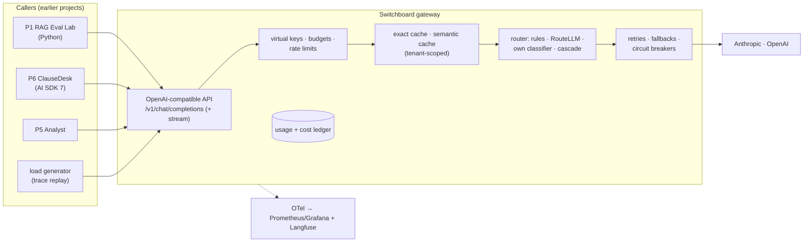

# 1. Requirements

## 1.1 Problem statement

By 2026, the **LLM gateway** has become the control point of an AI stack. It's where spend, reliability,
security and observability meet (Palo Alto Networks acquired Portkey for that reason). Every team asks
the same questions:
- Why did the bill double?
- Which feature is expensive?
- Can easy requests go to a cheaper model without hurting quality?
- Can repeated questions be answered from a cache?
- What happens when a provider is down?

Gateways are also a **security** risk:
- In **March 2026, LiteLLM's PyPI package was compromised** (versions 1.82.7/1.82.8 carried a credential
  stealer, delivered through a compromised CI security scanner). The most popular open-source gateway
  briefly became a backdoor into the infrastructure it sat on.
- **Semantic caches can be poisoned or collided.** 2026 papers show crafted prompts that land in another
  user's cache entry.

**Goal:** Build **Switchboard**, a small, measured LLM gateway that Projects 1, 5 and 6 route their model
calls through, and prove with numbers what each cost feature saves and what it risks:

1. **One API** (OpenAI-compatible, streaming) over Anthropic and OpenAI. It has virtual keys per team/app,
   budgets, rate limits, retries, fallbacks and circuit breakers.
2. **Caching in three layers:**
   - provider **prompt caching**, made reliable by keeping prompt prefixes stable;
   - an **exact** response cache;
   - a tenant-scoped **semantic** cache, with measured false-hit rates and poisoning defences.
3. **Cost-aware routing:** rules, an off-the-shelf learned router (RouteLLM), our own small classifier and
   a cascade, compared on **quality-cost curves** over real workloads from earlier projects.
4. **Evidence:**
   - the **cost per 1k requests** before and after, with the **quality loss** measured on the eval sets
     from Projects 1 and 6;
   - gateway overhead;
   - a build-vs-buy comparison against LiteLLM and a managed gateway.

## 1.2 What gets built

| # | Component | What it is |
|---|---|---|
| C1 | **Gateway API** | OpenAI-compatible Chat Completions (streaming, tools, structured outputs), plus a pass-through `/v1/messages` for Anthropic-native callers that need its features (prompt-cache controls) |
| C2 | **Access & spend control** | Virtual keys (team, app, environment), per-key budgets (daily/monthly $), rate limits (requests and tokens/min), model allow-lists |
| C3 | **Reliability** | Retries with jittered backoff (on retryable errors only), per-provider circuit breakers, ordered fallbacks (same-capability models), timeouts, hedged requests for short calls (Could) |
| C4 | **Cache layers** | (a) prompt-cache helper: stable-prefix ordering + Anthropic `cache_control` injection; (b) exact cache (hash of the normalized request); (c) semantic cache (embedding + threshold, per tenant + per model + per system-prompt version) |
| C5 | **Router** | Policies: `fixed`, `rules`, `routellm-mf`, `classifier`, `cascade`. Picks a model tier per request and records why |
| C6 | **Ledger & dashboards** | Per-request cost from provider-reported usage; Grafana dashboards (cost per request/team, TTFT, p95, cache hit rates, fallback rates); traces in Langfuse |
| C7 | **Evaluation harness** | Trace replay, quality scoring with Project 1/6 eval sets, the semantic-cache false-hit study, poisoning tests, router Pareto curves, gateway overhead benchmark, build-vs-buy |

## 1.3 Users & use cases

| Actor | Use case |
|---|---|
| **App developer** (P1/P5/P6) | Changes the model base URL and key; nothing else changes. Gets fallbacks, caching and cost tracking |
| **Team lead** | "How much did ClauseDesk spend yesterday, and on what?", with alerts at 80% of budget |
| **Platform engineer** | Adds a provider, sets routing policy per app, sees breaker trips |
| **Finance / FinOps** | Cost per 1k requests by app and model; savings from caching and routing |
| **Security reviewer** | Confirms that caches are tenant-isolated, prompts aren't stored where they shouldn't be, and the supply chain is pinned |

## 1.4 Functional requirements

### API and access

| ID | Requirement | Priority |
|---|---|---|
| FR-1 | OpenAI-compatible `/v1/chat/completions` with SSE streaming, tool calls and JSON-schema outputs, translated to Anthropic and OpenAI | Must |
| FR-2 | `/v1/models` listing what the key may use; model **aliases** (`fast`, `smart`, `auto`) mapped to real models by policy | Must |
| FR-3 | Virtual keys (hashed at rest) with team, app, environment, model allow-list, budget and limits | Must |
| FR-4 | Budgets: soft alert at 80%, hard stop at 100% (configurable per key); `402`-style error with a clear message | Must |
| FR-5 | Rate limits: requests/min and tokens/min per key (token estimate before, reconcile after) | Must |
| FR-6 | Anthropic pass-through `/v1/messages` (for callers using Anthropic-specific features) | Should |
| FR-7 | Admin API + CLI: keys, budgets, routing policies, cache controls (flush per tenant, per prompt version) | Must |

### Reliability

| ID | Requirement | Priority |
|---|---|---|
| FR-8 | Retries only on retryable errors (429, 5xx, timeouts, overloaded), with jittered backoff, honouring `Retry-After`; never retry after streaming has started sending tokens | Must |
| FR-9 | Circuit breaker per (provider, model): open after N failures in a window; half-open probes | Must |
| FR-10 | Fallback chains per alias (e.g. `smart`: Claude mid → OpenAI mid); a fallback never silently downgrades capability (tools/JSON support checked) | Must |
| FR-11 | Timeouts: connect, first-token, total | Must |
| FR-12 | Hedged requests for short, idempotent calls (send a second request if the first is slow) | Could |

### Caching

| ID | Requirement | Priority |
|---|---|---|
| FR-13 | **Prompt-cache helper:** reorder nothing semantic, but keep stable parts (system prompt, tool definitions, long documents) first; add Anthropic `cache_control` breakpoints; report cached-token share per app | Must |
| FR-14 | **Exact cache:** key = hash(tenant, model, normalized messages, tools, params); only when `temperature = 0` (or caller opts in) and there are no tool results in the history; TTL per app | Must |
| FR-15 | **Semantic cache:** only for opted-in apps and request types; scoped by tenant, model, system-prompt version and tool set; threshold per app; stores embeddings and responses, never across tenants | Must |
| FR-16 | Poisoning defences: don't cache responses to requests that contain untrusted retrieved content or tool output (unless the app opts in); verify-on-hit for high-risk apps (a cheap check that the cached answer fits the new question); per-tenant write rate limits | Must |
| FR-17 | Cache controls: bypass header, per-tenant flush, invalidation by prompt version; responses marked with `x-cache: hit/miss/semantic` | Must |

### Routing

| ID | Requirement | Priority |
|---|---|---|
| FR-18 | Routing policies per app: `fixed`, `rules` (length, task tag, tools needed), `routellm-mf` (off-the-shelf), `classifier` (our model), `cascade` (small first, escalate on low confidence/verifier fail) | Must |
| FR-19 | Every routed request records the policy, the decision, the score and the chosen model (for analysis and debugging) | Must |
| FR-20 | Caller can pin a model (`model: "claude-…"`) to bypass routing | Must |
| FR-21 | Router threshold per app, set from the Pareto curve (a target cost or quality) | Should |

### Observability and ledger

| ID | Requirement | Priority |
|---|---|---|
| FR-22 | Ledger row per request: key, app, model requested/used, tokens (input, cached, output), cost, cache status, route decision, latency, TTFT, fallback used | Must |
| FR-23 | OTel GenAI spans and metrics; Prometheus metrics; Grafana dashboards | Must |
| FR-24 | Prompt/response logging **off by default**; opt-in per app with redaction (Presidio, as in Project 2) | Must |

## 1.5 Non-functional requirements (targets)

| Area | Target |
|---|---|
| Overhead | Gateway adds p95 ≤ 15 ms (non-streaming, cache miss, excluding provider time) and ≤ 5 ms to TTFT for streaming |
| Cache latency | Exact hit p95 ≤ 5 ms; semantic hit p95 ≤ 40 ms (embedding + vector lookup) |
| Throughput | 500 req/s on one small instance with a mock provider |
| Availability | A single provider outage → fallback success ≥ 99% for aliases with a fallback |
| Accuracy of cost | Ledger matches provider invoices/usage within 1% |
| Quality guard | Routing/caching configurations shipped with quality loss ≤ the agreed budget (e.g. ≤ 2 points on P1's answer-correctness metric) |
| Supply chain | All dependencies pinned with hashes; CI actions pinned by commit SHA; no auto-updating packages in production images |

## 1.6 Success criteria

1. **Cost per 1k requests** for replayed P1/P6 workloads, before vs after (prompt caching, exact cache,
   semantic cache, routing), each with its **measured quality change and CI**.
2. A **semantic-cache study:** hit rate vs false-hit rate across thresholds, with a poisoning attack shown
   working without defences and failing with them.
3. **Router Pareto curves:** cost vs quality for every policy, with the chosen operating point justified.
4. **Reliability demo:** a provider outage injected → breakers open → fallbacks serve → recovery. Graphs included.
5. **Overhead and build-vs-buy:** Switchboard vs LiteLLM proxy vs a managed gateway, on overhead and features.
6. ClauseDesk (P6) switched to the gateway with a one-line provider change, showing the before-and-after.

## 1.7 Scope

**In scope:**
- The gateway: API, keys, budgets, limits, reliability, three cache layers, five routing policies.
- The ledger and dashboards.
- The evaluation harness using earlier projects' eval sets and traces.

**Out of scope:**
- Hosting open-weight models (routing targets are API models; a local model is a Could).
- Guardrail content filtering, which is covered in Project 2 and could plug in later.
- Billing end customers (Project 6 does that).
- Multi-region deployment.

**Time box:** 4 weeks in the roadmap (weeks 38–41), the core plan (Option B) of the [build plan](09-build-plan/README.md).
