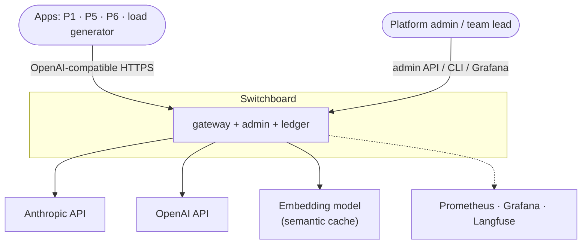
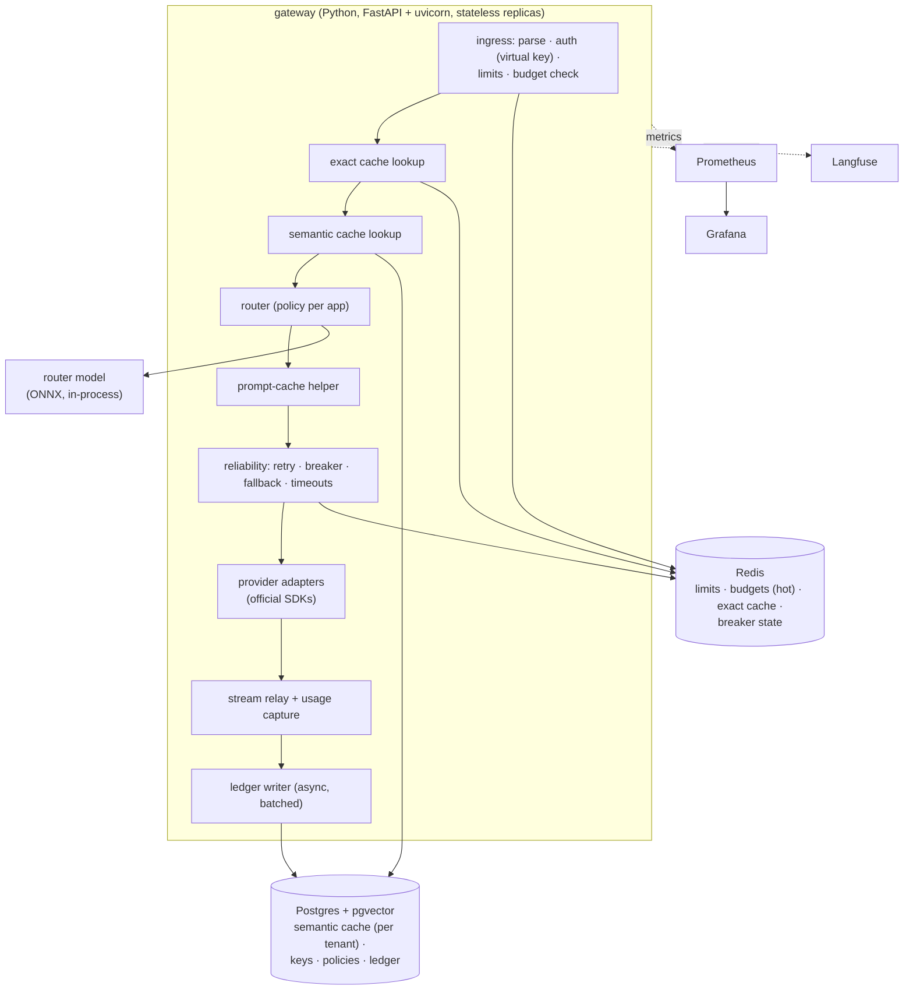
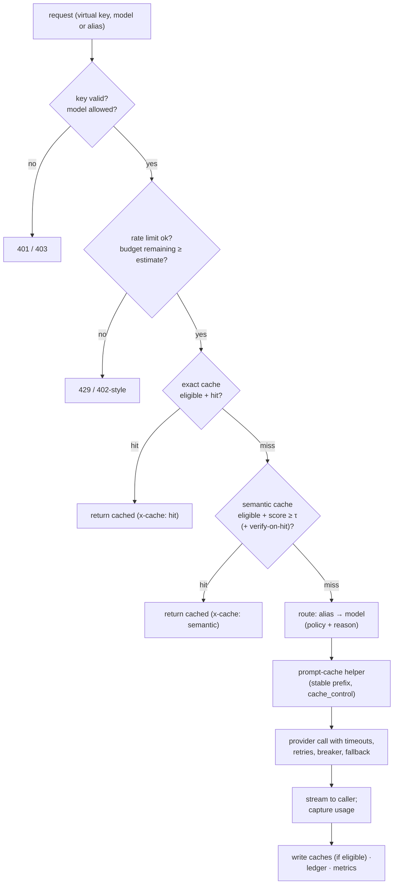
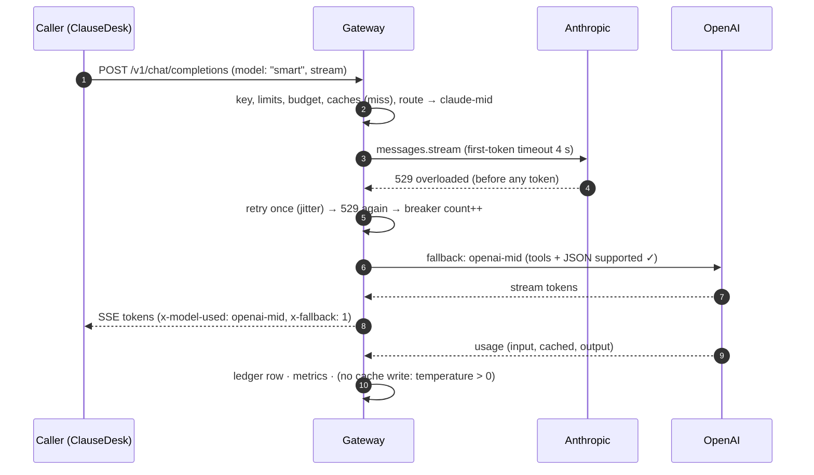
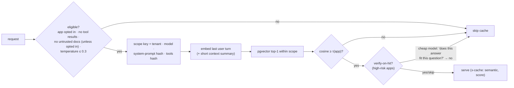
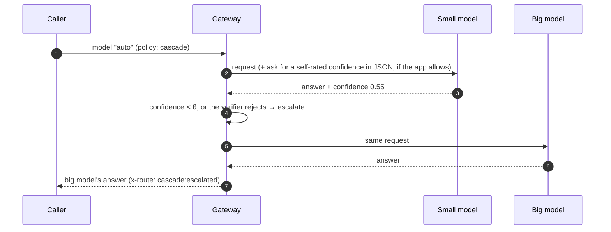
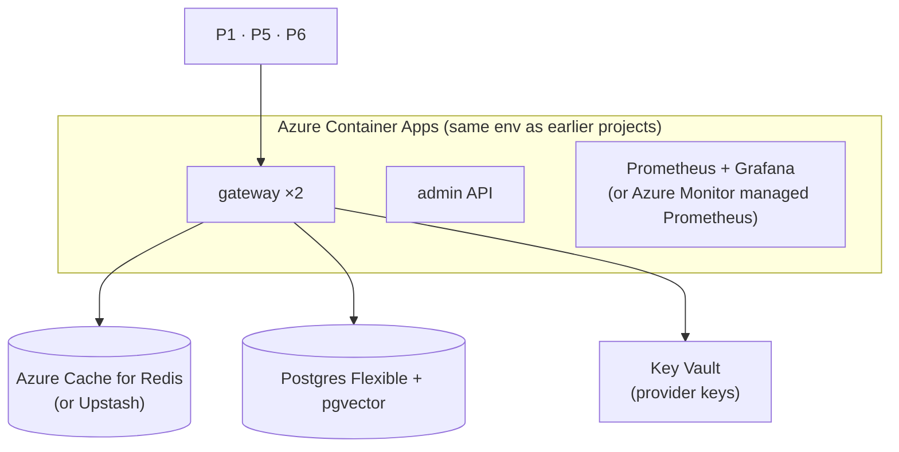

# 2. High-Level Architecture

## 2.1 Design principles

1. **Measure every saving against its quality cost.** No cache or router ships without a number for what
   it saves and what it breaks.
2. **Never trade correctness for a cache hit across trust boundaries.** Caches are scoped by tenant,
   model, system-prompt version and tool set. Anything built from untrusted content isn't cached by
   default.
3. **Cheap checks first.** The request pipeline runs from cheapest to most expensive: auth → budget →
   exact cache → semantic cache → routing → provider.
4. **Fail open for reliability, fail closed for money and safety.** A cache outage means a miss. A budget
   store outage means deny (configurable). A router outage means the default model.
5. **The provider's numbers are the truth.** Cost comes from provider-reported usage, including cached
   tokens, not from our estimates.
6. **Small, pinned, auditable.** A gateway sees every prompt and every key, so dependencies are few,
   pinned and scanned. This is the lesson of the 2026 LiteLLM compromise.

## 2.2 System context (C4 level 1)



## 2.3 Containers (C4 level 2)



| Container | Responsibility |
|---|---|
| **gateway** | Everything on the request path; stateless, scales horizontally |
| **Redis** | Hot state: rate-limit buckets, budget counters, exact cache, breaker state |
| **Postgres + pgvector** | Keys (hashed), policies, semantic cache (vectors + responses, partitioned by tenant), ledger |
| **router model** | A small classifier exported to ONNX, loaded in-process (≤ 2 ms inference) |
| **Prometheus + Grafana** | Metrics and dashboards (cost, latency, cache, routing, reliability) |
| **Langfuse** | Traces (as in the other projects) |

## 2.4 The request pipeline



## 2.5 Data flow A: a streamed request with fallback



A retry or fallback is only allowed **before the first token is sent** to the caller. After that, an error
is passed through, because a half-streamed answer can't be silently restarted.

## 2.6 Data flow B: semantic cache with scoping and verification



## 2.7 Data flow C: cascade routing



Cascades cost more on hard requests (two calls) and less on easy ones. The evaluation measures the
break-even point per workload ([04 §4.4](04-evaluation-design.md#44-routing-evaluation)).

## 2.8 Deployment view



Provider keys live only in Key Vault and the gateway's memory. Callers only ever hold **virtual keys**.

## 2.9 Proposed repository layout

```
switchboard/
├─ gateway/            # FastAPI app: api/, auth/, limits/, cache/{exact,semantic,prompt}/, router/, providers/, reliability/, ledger/
├─ router-training/    # data prep from earlier projects' evals, classifier training, ONNX export
├─ admin/              # admin API + CLI (swctl)
├─ evals/              # trace replay, quality scoring, cache study, poisoning, Pareto, overhead, build-vs-buy
├─ traces/             # recorded, anonymized request traces from P1/P6 (no customer data)
├─ dashboards/         # Grafana JSON
├─ infra/              # Terraform, compose
└─ docs/
```
