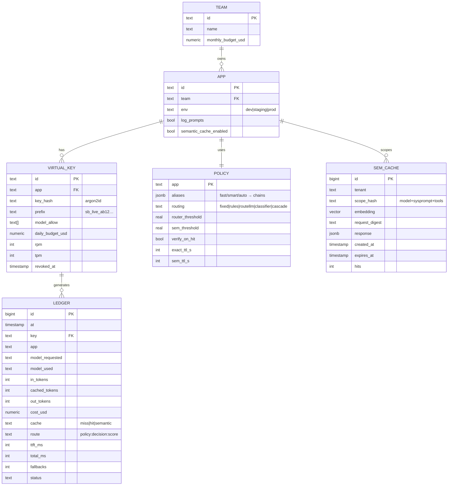
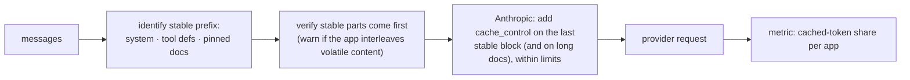
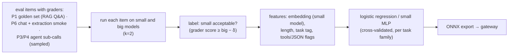

# 3. Low-Level Design

## 3.1 Data model

Ledger is partitioned by month. The semantic cache is partitioned by tenant (list partitions per large
tenant, hash partitions for the rest) and has an HNSW index per partition.

## 3.2 API surface

| Endpoint | Purpose |
|---|---|
| `POST /v1/chat/completions` | OpenAI-compatible (stream / non-stream, tools, `response_format`) |
| `POST /v1/messages` | Anthropic pass-through (Should), same auth, limits, ledger |
| `GET /v1/models` | Models and aliases allowed for the key |
| Response headers | `x-request-id`, `x-model-used`, `x-cache`, `x-cache-score`, `x-route`, `x-fallback`, `x-cost-usd` (non-stream), `x-budget-remaining` |
| Request headers | `x-sb-cache: bypass`, `x-sb-task: extraction|chat|summarize…` (routing hint), `x-sb-trust: untrusted-context` (disables semantic cache for this call) |
| Admin API (`/admin`) | Keys, budgets, policies, cache flush/invalidate, ledger queries (admin token, IP allow-list) |

## 3.3 Translation (OpenAI format → providers)

| Feature | OpenAI | Anthropic |
|---|---|---|
| System prompt | first `system` message | `system` field |
| Tools | `tools[].function` | `tools[]` (`input_schema`) |
| Structured output | `response_format: json_schema` | tool-forced JSON or native structured output (per SDK support; verify) |
| Streaming | SSE deltas | SSE events → converted to OpenAI deltas |
| Usage | `usage.prompt_tokens`, `prompt_tokens_details.cached_tokens` | `usage.input_tokens`, `cache_read_input_tokens`, `cache_creation_input_tokens` |
| Prompt caching | automatic above threshold | `cache_control` breakpoints (added by the helper) |

**Contract tests** feed the same conversation through both adapters and compare normalized outputs
(tool-call structure, JSON validity, usage fields).

## 3.4 Prompt-cache helper

The helper never reorders the conversation's meaning. It only inserts breakpoints, and it **reports**
when an app's prompts defeat caching (for example, a timestamp at the top of the system prompt, a common
mistake).

## 3.5 Caches

**Exact cache key:**
`sha256(tenant ‖ model ‖ canonical(messages) ‖ canonical(tools) ‖ params{temperature, max_tokens, response_format})`.
- Eligible only if `temperature == 0` or `x-sb-cache: allow`.
- No tool-result messages in the conversation.
- Stored in Redis with a TTL.

**Semantic cache:**
- **Scope** (exact match, never semantic): `tenant`, `model`, `sha256(system prompt)`, `sha256(tools)`.
- **Vector:** an embedding of the last user message plus a short digest of the previous turn (so
  "and in 2023?" doesn't collide across conversations).
- **Threshold τ per app**, chosen from the false-hit study ([04 §4.3](04-evaluation-design.md#43-semantic-cache-study)).
- **Verify-on-hit** (high-risk apps): a cheap model answers "Does ANSWER answer QUESTION? yes/no" (cost is
  logged); a "no" becomes a miss.
- **Write defences:**
  - don't write if the request had `x-sb-trust: untrusted-context` or included tool results (unless opted in);
  - per-tenant write rate limit;
  - store the full `request_digest` for audit;
  - TTL;
  - invalidate the whole scope when the system-prompt hash changes.

## 3.6 Routing policies

| Policy | How it decides | Training/data |
|---|---|---|
| `fixed` | Always the alias's first model | — |
| `rules` | Task tag, prompt length, tools required, JSON required → tier | Hand-written; the baseline |
| `routellm-mf` | Off-the-shelf matrix-factorization router (RouteLLM), threshold → strong/weak | Pretrained; calibrated on our data |
| `classifier` | Our small model predicts P(small model's answer is acceptable) from prompt features (embedding + length + task tag) | Labels from earlier eval sets: run small and big on each item and label "small was good enough" (§3.7) |
| `cascade` | Small model first; escalate if its confidence < θ or a verifier rejects | Thresholds from the Pareto analysis |

Every decision is logged as `policy:decision:score`, for example `classifier:small:0.83`.

## 3.7 Router training data

The split is by **source item**, with no leakage between train and test. A public routing benchmark subset
(RouterBench/LLMRouterBench) is used as an extra, external check.

## 3.8 Reliability settings (defaults)

| Setting | Default |
|---|---|
| Connect / first-token / total timeout | 2 s / 8 s (non-stream 30 s total) / 120 s stream |
| Retries | 2, only on 408/429/5xx/overloaded, before the first token, with jitter, honouring `Retry-After` |
| Breaker | Open after 5 failures in 30 s; half-open 1 probe after 20 s |
| Fallback | Next model in the alias chain whose capabilities cover the request (tools, JSON, context length) |
| Hedging (Could) | For `fast` alias, non-stream < 1k tokens: second request after p90 latency; first to finish wins; loser cancelled; both billed |

## 3.9 Cost computation

`cost = in_uncached × p_in + cached_read × p_cache_read + cache_write × p_cache_write + out × p_out`
- Prices come from a versioned `prices.yaml` per model and date.
- Token counts come from the provider's usage fields.
- Semantic-cache hits record the **verification cost** (if any) and a "saved" estimate, which is the cost
  of the call avoided, priced at the model that would have been used.

## 3.10 Error model

| Situation | Caller gets |
|---|---|
| Invalid/revoked key | `401` |
| Model not allowed | `403` with the allowed list |
| Budget exhausted | `402`-style error (`insufficient_quota`) with the reset time |
| Rate limited | `429` with `Retry-After` |
| All providers in the chain failed before streaming | `503` with a `request-id`; details in the ledger |
| Error after streaming started | Passed through as an SSE error event; no silent retry |
