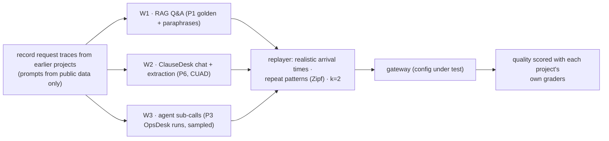

# 4. Evaluation Design

The question behind every experiment: **how much does this save, and what does it cost in quality, latency
or risk?**

## 4.1 Workloads (trace replay)

| Workload | Size | Quality metric (from the source project) |
|---|---|---|
| W1 RAG Q&A | 170 questions + 3 paraphrases each | Answer correctness, faithfulness (P1 judges) |
| W2 ClauseDesk | 60 chat questions + 30 extraction docs | Citation precision, CUAD F1 (P6 graders) |
| W3 Agent sub-calls | 1,000 sampled model calls from OpsDesk runs | Replay of the scenario outcome where possible; otherwise a judged equivalence |

**Repetition model:** real traffic repeats. The replayer mixes exact repeats, paraphrases and new
questions with a Zipf distribution, and the report shows how savings change with the repeat rate, instead
of assuming one.

## 4.2 Configurations compared

| Config | Description |
|---|---|
| C0 | Direct to provider (no gateway): the baseline |
| C1 | Gateway, pass-through (overhead only) |
| C2 | + prompt-cache helper |
| C3 | + exact cache |
| C4 | + semantic cache (τ from the study) |
| C5 | + routing (best policy from §4.4) |
| C6 | Everything (C2–C5) |

**Headline table:** cost per 1k requests, quality (with CI), p50/p95 latency and TTFT for C0–C6 on each
workload.

## 4.3 Semantic cache study

- **Labelled pairs:** 1,500 question pairs from W1/W2:
  - paraphrases, which should hit;
  - near-misses (same words, different meaning: "revenue in 2022" vs "revenue in 2023", "UK" vs "US"), which should not hit;
  - unrelated pairs.
- **For τ ∈ [0.80, 0.99] and two embedding models:**
  - true-hit rate;
  - **false-hit rate** (a wrong answer served);
  - end-to-end quality loss on replay.
- **With and without verify-on-hit:** the false-hit reduction versus its added cost and latency.
- **Output:** a per-workload τ, chosen to keep false hits ≤ 0.5% (configurable), and a chart.

**Poisoning and collision tests** (based on 2026 attacks):

| # | Attack | Expected with defences |
|---|---|---|
| P1 | Cross-tenant: tenant B tries to receive A's cached answer | Impossible (scope includes tenant) |
| P2 | Collision: crafted prompt with high similarity to a popular question, to plant a malicious answer | Blocked by scope + write rate limits; verify-on-hit catches mismatches; measured success rate |
| P3 | Poisoned context: a request containing untrusted retrieved text tries to get its answer cached | Not cached (`untrusted-context` / tool results rule) |
| P4 | System-prompt change: old answers served after a prompt update | Scope includes the system-prompt hash |

**Report:** attack success with defences off vs on.

## 4.4 Routing evaluation

For each policy (`fixed-small`, `fixed-big`, `rules`, `routellm-mf`, `classifier`, `cascade`) and a sweep of
thresholds:
- The **cost vs quality curve** per workload, with an "oracle" curve (the best possible choice per request,
  from the labels) as the upper bound.
- **APGR** (average performance gap recovered) and cost at fixed quality targets (95% / 98% of big-model
  quality).
- Latency effects (cascades add a second call on escalations).
- An external check on a public routing-benchmark subset.

**Held-out split:** items used to train the classifier are never used to evaluate it.

## 4.5 Reliability tests

| Test | Pass condition |
|---|---|
| Provider hard-down (fault proxy returns 503) | Breaker opens ≤ 30 s; fallback success ≥ 99%; no retries after first token |
| Slow provider (first token 10 s) | First-token timeout → fallback; caller TTFT bounded |
| 429 storm with `Retry-After` | Backoff honoured; no thundering herd (jitter) |
| Recovery | Half-open probe succeeds → breaker closes; traffic returns |
| Mid-stream failure | Error passed through; ledger marks the partial usage |

## 4.6 Overhead and load

- Mock provider with fixed latency (k6 load): gateway p50/p95 overhead at 50/200/500 req/s, with cache
  on and off.
- TTFT overhead for streaming.
- The same test against the **LiteLLM proxy** (pinned, known-good version) and a **managed gateway** (Vercel
  AI Gateway or Cloudflare AI Gateway free tier), for the build-vs-buy table.

## 4.7 Cost accuracy

- The ledger vs provider-reported usage for a replay day: within 1%.
- Cached-token accounting checked on Anthropic (read/write) and OpenAI (cached input).

## 4.8 CI gate

| Check | Blocks merge if |
|---|---|
| Unit + contract tests (translation, usage normalization, cost maths, cache keys, breaker state machine) | Any failure |
| Cache isolation tests (P1, P4) | Any cross-scope hit |
| Overhead micro-benchmark (mock provider) | p95 overhead > 15 ms |
| Supply chain: lockfile with hashes, actions pinned by SHA, image scan | Any unpinned dependency or high finding |
| Replay smoke (W1 subset, cheap models) | Quality drop > 2 points vs `main` for the shipped config |
