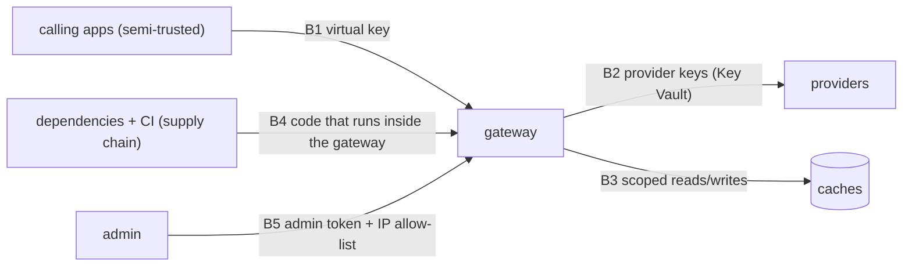

# 5. Security & Threat Model

A gateway sees **every prompt, every response and every provider key** in the organization. That makes it
one of the most valuable targets in an AI stack. The March 2026 LiteLLM compromise showed what that means
in practice.

## 5.1 Assets

| Asset | Why it matters |
|---|---|
| Provider API keys | Direct spend and data access at the providers |
| Virtual keys | Access to the gateway (and budgets) |
| Prompts and responses in transit | May contain customer data |
| Cache contents | Stored responses that can be served to others |
| Ledger | Financial record and usage analytics |
| The gateway host / cluster | Its credentials open doors to everything else |

## 5.2 Trust boundaries

## 5.3 Threats → controls → tests

| # | Threat | Control | Test |
|---|---|---|---|
| T1 | **Supply-chain compromise** of a dependency or CI tool (the 2026 LiteLLM/Trivy pattern) | Few dependencies; `uv` lockfile with hashes; GitHub Actions pinned by commit SHA; minimal CI secrets (OIDC to Azure, no long-lived keys); image scan; SBOM; no `.pth`/startup hooks allowed (check in CI); runtime egress restricted to provider endpoints | CI supply-chain job; egress test |
| T2 | **Provider key theft** | Keys only in Key Vault → process memory; never logged; never returned; rotated; the gateway identity can read only its own secrets | Log scanner; config review |
| T3 | **Virtual key leakage / brute force** | Stored as HMAC-SHA256 with a server-side pepper (keys are 256-bit random, so a slow hash only adds latency); prefix for identification; per-key limits; revocation; alerts on anomalies (spend spike, new IP ranges) | Unit tests; anomaly alert test |
| T4 | **Cross-tenant cache leakage** | Tenant in every cache scope; separate partitions; no global cache | P1 test |
| T5 | **Semantic cache poisoning / collision** | Write rules (no untrusted context), per-tenant write limits, scope by system prompt + tools, threshold per app, verify-on-hit for high-risk apps, TTL | P2–P4 tests |
| T6 | **Budget bypass** (parallel requests racing the budget check) | Atomic reserve-then-reconcile in Redis (reserve the estimate, settle the actual); fail closed if the budget store is down | Concurrency test |
| T7 | **Prompt/response data exposure** via logs | Logging off by default; opt-in with Presidio redaction; short retention; ledger has no content | Log scanner |
| T8 | **Admin API abuse** | Separate admin token, IP allow-list, audit of every change | Auth tests |
| T9 | **SSRF / provider URL tampering** via config | Provider base URLs from a fixed allow-list; no per-request URLs | Config validation test |
| T10 | **Denial of wallet** (expensive prompts, huge `max_tokens`) | Per-key token limits, max `max_tokens` per alias, budgets | Limit tests |

## 5.4 The LiteLLM incident as a design input

| What happened (March 2026) | Design response here |
|---|---|
| Attackers compromised a CI **security scanner** used by the project, then stole PyPI publishing credentials | Actions pinned by SHA; publishing (if any) via trusted publishing (OIDC), not tokens; scanners run without publishing secrets |
| Malicious versions shipped a `.pth` file that ran on **every Python start** | CI check that fails on unexpected `.pth` files in the environment; install with `--require-hashes`; no auto-upgrade |
| Payload stole cloud credentials and moved laterally in Kubernetes | Gateway runs with a narrow managed identity; egress allow-list to provider domains only |
| Many users pulled the bad version within ~40 minutes | Pinned versions + hash checks mean a new upstream release is never pulled automatically |

This is also why the gateway **doesn't depend on LiteLLM at run time**. It uses the official provider SDKs
directly. LiteLLM is used only as a **benchmark comparison**, pinned to a known-good version in an
isolated container ([ADR-002](07-decisions.md)).

## 5.5 Mapping to OWASP

| OWASP LLM (2025) | Covered by |
|---|---|
| LLM02 Sensitive information disclosure | T4, T7 |
| LLM03 Supply chain | T1 |
| LLM04 Data and model poisoning (cache) | T5 |
| LLM10 Unbounded consumption | T6, T10 |

## 5.6 Residual risks

- **Verify-on-hit is probabilistic.** It lowers false hits but doesn't remove them. High-stakes apps
  should keep the semantic cache off (the default).
- **Routing can hide quality regressions** on rare request types. The per-task-family monitoring and the
  shipped quality budget are the mitigation.
- **Provider-side incidents** (a leaked key at the provider) are outside our control. Rotation and spend
  alerts limit the damage.
