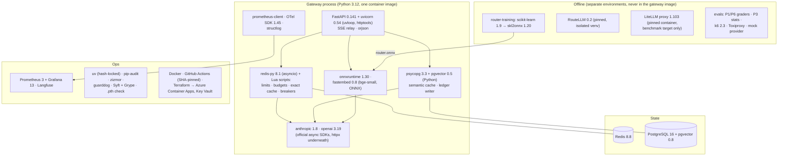

# 8. Tech Stack: What We Use and Why

For every technology in this project, this document answers five questions:
1. **What does it do in this system?**
2. **Why was it chosen?**
3. **What alternatives were considered, and why weren't they chosen?**
4. **What does it add to your profile?**
5. **When would we replace it?**

Selection criteria (adjusted for a gateway, which sees every key and every prompt):

| # | Criterion | Meaning |
|---|---|---|
| C1 | **Small, auditable supply chain** | Every run-time dependency is a place an attacker can hide (the LiteLLM lesson). Fewer, well-known packages win |
| C2 | **Hot-path latency** | The gateway's own overhead must stay ≤ 15 ms p95 ([06 §6.1](06-non-functional.md#61-latency-budget-gateway-overhead-cache-miss)) |
| C3 | **Measurability** | Every cost feature has to produce numbers (ledger, metrics, eval harness) |
| C4 | **Market value** | Gateways, FinOps, caching and routing appear in 2026 GenAI and AI Platform JDs (see [01-market-analysis](../../../01-market-analysis.md)) |
| C5 | **Reuse** | Reuses Projects 1, 3, 4 and 6 (graders, statistics, Toxiproxy, Azure modules) |
| C6 | **Cost** | Development and demo within ~$30–40/month plus ~$30–60 of one-off eval spend |

---

## 8.1 The stack at a glance

## 8.2 Summary table

| Layer | Choice | One-line reason | Main alternative (not chosen) |
|---|---|---|---|
| Language / server | **Python 3.12, FastAPI 0.141, uvicorn 0.54** (uvloop + httptools) | Matches the portfolio and the ML routing code; async streaming is easy | Go (faster, but a second language for the ML parts), Granian (faster server; measure later) |
| Provider access | **anthropic 1.8 + openai 3.19** official async SDKs behind in-house adapters | Two well-maintained packages instead of one large translation library (ADR-002) | LiteLLM as a library (100+ providers; much larger dependency surface; compromised in March 2026) |
| Hot state | **Redis 8.8** via **redis-py 8.1** asyncio, with **Lua scripts** | Atomic rate limits and budget reservations in one round trip | Postgres counters (too slow per request), in-process only (wrong with 2+ replicas) |
| Semantic cache + ledger | **PostgreSQL 16 + pgvector 0.8** (HNSW), **psycopg 3.3** async pool | Same database as earlier projects; SQL filters for the scope + vector search together | Redis vector search (another index to operate), a dedicated vector DB (overkill) |
| Embeddings (cache + router features) | **fastembed 0.8** with **BAAI/bge-small-en-v1.5** (ONNX, local, 384-d) | ~5 ms on CPU, no network call, no per-request cost | OpenAI `text-embedding-3-small` (the second model in the cache study, not the default) |
| Router model | **scikit-learn 1.9** (logistic regression / small MLP) → **skl2onnx 1.20** → **onnxruntime 1.30** | ≤ 2 ms in-process; the gateway image has no scikit-learn or torch (ADR-006) | Pickled sklearn in the gateway (unsafe loading, heavier image), LLM-as-router (slow) |
| Off-the-shelf router | **RouteLLM 0.2** (`mf` router), **offline only**, isolated venv | The best-known open learned router, as a baseline | NotDiamond / Martian (hosted, closed) |
| Retries, breakers, fallbacks | **In-house** (~300 lines), breaker state in Redis | Must know "has the first token been sent?" and honour `Retry-After` per provider | tenacity / pybreaker (generic; neither knows about streams; pybreaker isn't async) |
| Token estimates | **tiktoken 0.14** (OpenAI), chars/3.5 × safety margin (Anthropic) | Local and fast; only used to *reserve*; usage fields settle the real cost | Anthropic's `count_tokens` endpoint (a network call per request) |
| Key hashing | **HMAC-SHA256 with a server-side pepper** (stdlib `hmac`) | Keys are 256-bit random, so a slow hash adds nothing but latency | argon2id (≈ 20–50 ms per check; only right for low-entropy passwords) |
| Config | **pydantic 2.13 + pydantic-settings 2.15**; `prices.yaml`, `policies.yaml` validated at startup | Typed config, fails fast on a bad price or alias | Env vars only |
| Admin CLI | **Typer 0.27** (`swctl`) | Small, typed CLI over the admin API | Click directly |
| Redaction (opt-in logging) | **Presidio 2.2** (as in Project 2), in the log worker only | Reuses Project 2's setup; never on the hot path | Regex only |
| Metrics / dashboards | **prometheus-client 0.26 → Prometheus 3 → Grafana 13** | The FinOps dashboard everyone recognises (ADR-010) | Azure Monitor managed Prometheus (fine in production; less portable for the demo) |
| Traces | **OpenTelemetry SDK 1.45** (GenAI conventions) → **Langfuse 4.15** | Same trace store as Projects 1–6 | Separate tracing per provider |
| Tests | **pytest 9.1, hypothesis 6.168, respx 0.23, vcrpy 8.3** | Property tests for cost and keys; recorded cassettes for provider contracts | Live-API tests only (slow, flaky, costly) |
| Load / faults | **k6 2.3**, **Toxiproxy** (from Project 4), our **mock provider** | Repeatable load and outages without spending money | Locust (Python; noisier at 500 req/s) |
| Supply chain | **uv 0.12** hash-locked, **pip-audit**, **guarddog**, **zizmor**, **Syft + Grype**, `.pth` check | Directly answers the March 2026 incident ([05 §5.4](05-security-threat-model.md#54-the-litellm-incident-as-a-design-input)) | Unpinned `pip install`; tag-pinned actions |
| Benchmark targets | **LiteLLM proxy 1.103** (pinned by digest, isolated) and **Vercel AI Gateway** (managed) | The open-source and managed gateways people actually compare | Portkey, Kong AI Gateway (similar story; one of each kind is enough) |
| Infra | **Terraform → Azure Container Apps**, Key Vault, the existing Postgres Flexible server | Reuses earlier projects' modules | AKS (unnecessary for two replicas) |

---

## 8.3 Detailed rationale

### Gateway core

#### FastAPI + uvicorn
- **Role:** `/v1/chat/completions`, `/v1/models`, the Anthropic pass-through `/v1/messages` (Should) and
  `/admin`. Streaming responses relay provider SSE chunks as OpenAI-format deltas.
- **Why:**
  - Async by default; `StreamingResponse` with `text/event-stream` is enough for SSE.
  - Pydantic models give a typed OpenAI request schema.
  - It is the framework used across the portfolio (C5).
- **Watch:**
  - **Nothing blocking on the event loop.** ONNX inference and embeddings run in a small thread pool
    (`anyio.to_thread`), and the overhead benchmark checks event-loop lag.
  - Run with `--loop uvloop --http httptools` and several workers per container. Measure before tuning.
  - Middleware stacks add latency. Auth, limits and caching are **plain functions in one pipeline**, not
    five Starlette middlewares.
- **Not chosen:** Go or Rust (ADR-009). The overhead report says when you'd switch.
- **Revisit:** If p95 overhead exceeds 15 ms after profiling, try Granian as the server, then move the
  relay to Go as the documented next step.

#### Official provider SDKs: `anthropic` 1.8 and `openai` 3.19
- **Role:** One adapter per provider behind a `Provider` interface: `translate(request)`,
  `stream(request) → deltas`, `usage(response)`, `classify_error(exc) → retryable?`.
- **Why:**
  - Two packages maintained by the providers themselves (C1).
  - Typed errors (`RateLimitError`, `APIStatusError`, overloaded) make the retry rules precise.
  - Both expose usage including cached tokens, which the ledger needs.
- **Watch:**
  - **Turn off the SDKs' own retries** (`max_retries=0`). The gateway owns retries, otherwise a single
    request can silently become six provider calls.
  - Set explicit `httpx` timeouts and connection-pool limits per client; reuse one client per provider
    per worker.
  - Both SDKs have moved major versions since 2025. Pin exactly, and read the changelog before each bump:
    the contract tests (§8.3 Tests) are the safety net.
  - OpenAI side: call **Chat Completions** so the front door and the upstream speak the same format. The
    Responses API is a later option for OpenAI-only features.
- **Not chosen:** LiteLLM as a library (ADR-002); raw `httpx` calls (more code to keep up with API changes,
  no typed errors).
- **Revisit:** A third provider (Gemini, a local model) means a new adapter + contract tests, not a new
  library.

### Hot state: Redis 8.8 + Lua

- **Role:**
  - **Rate limits:** a token bucket per key (requests and tokens per minute).
  - **Budgets:** `reserve(estimate)` and `settle(actual)` as Lua scripts, so check-and-decrement is atomic
    (T6 in the threat model).
  - **Exact cache:** response bodies with a TTL, keyed by the canonical hash.
  - **Breaker state:** failure counts per (provider, model) shared across replicas.
  - **Key metadata cache:** a short-TTL copy of the key row, to stay inside the 2 ms lookup budget.
- **Why:** One network round trip per step, atomic scripts, and the client (`redis-py` asyncio) is the
  standard (C2).
- **Watch:**
  - Load scripts once with `SCRIPT LOAD` and call `EVALSHA`; reload on `NOSCRIPT`.
  - Budgets must survive a Redis restart. On startup the gateway **rebuilds today's counters from the
    ledger** in Postgres, so Redis can run without persistence.
  - Redis 8 is licensed under AGPLv3 / RSALv2 / SSPLv1 (your choice). Using it unmodified as a server is
    fine. **Valkey 9** is a drop-in alternative if a licence review asks for BSD.
- **Deployment:** A Redis 8 container app (internal TCP ingress) for the demo. **Azure Managed Redis** is
  the production path; check the smallest tier's price before switching.
- **Not chosen:** Upstash over the internet for the hot path (fine for Project 6's streams; the extra
  network hop would eat most of the overhead budget).

### Semantic cache and ledger: Postgres + pgvector

- **Role:** The `sem_cache` table (partitioned by tenant, HNSW index per partition) and the monthly-
  partitioned `ledger`.
- **Why:**
  - A cache lookup is **one query**: exact filters on the scope columns (`tenant`, `scope_hash`,
    `expires_at`) plus `ORDER BY embedding <=> $1 LIMIT 1`. pgvector 0.8's iterative index scans keep
    filtered HNSW queries returning results.
  - Same server as earlier projects, so no new service (C5, C6).
- **Watch:**
  - Set `hnsw.ef_search` and enable iterative scans (`hnsw.iterative_scan = relaxed_order`) per session.
    Check recall on the study's labelled pairs, not just speed.
  - Ledger writes are **batched** (`COPY` via psycopg, ≤ 200 ms or 500 rows) off the request path
    ([06 §6.2](06-non-functional.md#62-throughput-and-scaling)).
  - Azure Postgres Flexible needs `vector` added to the `azure.extensions` allow-list first.
- **Not chosen:** Redis vector search (another index to size and secure); Qdrant or similar (one more
  service for a table-sized problem).

### Embeddings: fastembed + bge-small-en-v1.5

- **Role:** Embeds the last user turn (+ previous-turn digest) for the semantic cache, and provides the
  embedding features for the router classifier.
- **Why:** Runs in-process on ONNX Runtime at ~5 ms per short prompt on CPU, costs nothing per request,
  and sends no prompt text to another API (C2, C6).
- **Watch:** The model files download on first use. **Bake them into the image** at build time with a
  checksum, so production never fetches anything from the internet.
- **Compared in the study ([04 §4.3](04-evaluation-design.md#43-semantic-cache-study)):** OpenAI
  `text-embedding-3-small`. If the API model has a clearly better false-hit curve, the study will show
  whether that's worth ~30 ms and a per-request cost.

### Routing

#### Our classifier: scikit-learn → ONNX → onnxruntime
- **Role:** Predicts *P(small model's answer is acceptable)* from the embedding, prompt length, task tag
  and tools/JSON flags ([03 §3.7](03-low-level-design.md#37-router-training-data)).
- **Why:**
  - Logistic regression or a small MLP is enough for a binary decision and trains in seconds.
  - Exporting to ONNX means the gateway image has **onnxruntime only**, with no scikit-learn, no pickle
    loading and no torch (C1, C2).
- **Watch:**
  - skl2onnx releases lag scikit-learn. Check the export on day one (§8.6); if it fails, pin scikit-learn
    to the newest version skl2onnx supports.
  - Version the model file with its training data hash and threshold; the gateway logs the model version
    in every route decision.
- **Revisit:** Only move to a small transformer if the Pareto curve shows the linear model leaving real
  savings on the table.

#### RouteLLM (off-the-shelf baseline), offline only
- **Role:** The `routellm-mf` policy in the Pareto study ([04 §4.4](04-evaluation-design.md#44-routing-evaluation)).
- **Why:** The open learned-router baseline that routing papers compare against.
- **Watch (important):**
  - The last release is **0.2.0 (July 2024)**. It depends on **torch, transformers and an unpinned
    `litellm`**, and its MF router embeds prompts with an OpenAI embedding model.
  - So it **never goes into the gateway image**. It runs in its own `uv` environment under
    `router-training/`, with every package hash-locked and `litellm` pinned to a known-good version
    (never 1.82.7 or 1.82.8). It scores the eval items offline, and the Pareto study reads those scores.
  - If `routellm-mf` turns out to be the best policy for an app, port only its scoring: the matrix-
    factorisation weights as a small ONNX or NumPy model, with the same embedding call.

#### Cascade
- **Role:** Small model first; escalate if its confidence (log-prob where the provider exposes it, else a
  self-rating) is below θ or a verifier rejects the answer.
- **Stack:** No new library. It reuses the provider adapters and the graders from Projects 1 and 6 as
  verifiers, which is why cascade runs non-streaming only.

### Reliability: in-house retries, breakers and fallbacks

- **Role:** Retries with full jitter, `Retry-After` handling, per-(provider, model) circuit breakers,
  capability-checked fallback chains, and connect / first-token / total timeouts
  ([03 §3.8](03-low-level-design.md#38-reliability-settings-defaults)).
- **Why in-house:**
  - The rule that matters most, **no retry after the first token is sent** (ADR-007), needs the retry loop
    to know the stream's state. Generic retry libraries don't.
  - It's ~300 lines with property tests, and it's the part interviewers ask you to explain.
- **Watch:** Breaker state lives in Redis so replicas agree. If Redis is down, each replica keeps a local
  breaker ([06 §6.5](06-non-functional.md#65-failure-modes)).
- **Not chosen:** tenacity (good for plain retries, but not stream-aware); pybreaker (not async); service
  mesh retries (can't see tokens or `Retry-After` semantics per provider).

### Observability

- **Prometheus metrics** via `prometheus-client`, named after the OTel GenAI conventions where they exist
  ([06 §6.4](06-non-functional.md#64-observability)). **Prometheus 3 + Grafana 13** run as container apps
  in the demo, with dashboards stored as JSON in `dashboards/`.
- **Traces** via the OTel SDK into **Langfuse**, one span per request with cache and route decisions as
  attributes, as in the earlier projects.
- **Logs** via structlog as JSON. Prompt/response logging is off by default; the opt-in path redacts with
  Presidio in a background worker.
- **Watch:** Label cardinality. Never label metrics by key ID or user; use app, team, model, policy and
  result only.

### Evaluation and testing

- **Trace replay:** a small async replayer (httpx) that re-sends recorded P1/P3/P6 requests with a
  repetition model. It scores quality with **each project's own graders** and computes CIs with Project 3's
  statistics module (ADR-011).
- **Mock provider:** a tiny FastAPI app that speaks both the OpenAI and Anthropic streaming formats, with
  configurable latency, token rate and error injection. It's the target for k6 and Toxiproxy runs, so load
  tests cost nothing.
- **Unit and property tests:** pytest + hypothesis for cost maths, canonical cache keys, budget
  reserve/settle under concurrency, and breaker state transitions.
- **Provider contract tests:** vcrpy cassettes recorded once against the real APIs (secrets scrubbed), and
  respx for error cases (429 with `Retry-After`, overloaded, mid-stream disconnect).
- **Load and faults:** k6 2.3 at 500 req/s against the mock; Toxiproxy (from Project 4) for latency,
  resets and outages.
- **Build vs buy:** the same k6 scenario against the pinned **LiteLLM proxy** container and **Vercel AI
  Gateway**. The LiteLLM container runs on an isolated network with test-only provider keys that have low
  spend limits.

### Supply chain (the stack's own defences)

| Control | Tool | Catches |
|---|---|---|
| Exact, hash-locked dependencies | `uv lock` → `uv export --require-hashes`; `pip install --require-hashes --no-deps` in the image | A new upstream release, or a swapped file, being pulled silently |
| Known-vulnerability check | **pip-audit** in CI | CVEs in pinned versions |
| Malicious-package heuristics | **guarddog** on any new or bumped dependency | Install hooks, obfuscated code, exfiltration patterns |
| `.pth` check | A 20-line script that lists `.pth` files in site-packages and fails on anything not on an allow-list | The exact LiteLLM 1.82.7/1.82.8 mechanism |
| Workflow hardening | **zizmor** on `.github/workflows`; every action pinned to a **commit SHA**; `permissions: {}` by default | Tag hijacking, over-privileged tokens, template injection |
| Image contents | **Syft** SBOM + **Grype** scan, both installed from checksummed release binaries, not a mutable action tag | Vulnerable OS packages; a record of what shipped |
| Base image | `python:3.12-slim` **pinned by digest**, non-root user, no shell tools added | Base-image drift |
| Run-time egress | Container Apps egress limited to the two provider API domains, Postgres, Redis, Key Vault and Langfuse | Exfiltration if something does get in |

The March 2026 compromise came in through a **CI security scanner**. So scanners here run in a job that has
**no secrets and no write permissions**, and their binaries are verified by checksum before running.

### Infrastructure

- **Terraform → Azure:** Container Apps (gateway ×2, admin API, Redis, Prometheus, Grafana), the existing
  Postgres Flexible server, Key Vault for provider keys, and a user-assigned managed identity with access
  to Key Vault only.
- **Local:** Docker Compose with the gateway, Redis, Postgres + pgvector, Prometheus, Grafana, Toxiproxy and
  the mock provider.
- **Scale to zero** for the demo between sessions; Postgres is shared with earlier projects, so it adds $0.

---

## 8.4 What this stack adds to your profile

| New on your profile after this project | Evidence produced |
|---|---|
| LLM gateway engineering (OpenAI-compatible API, streaming relay, provider adapters) | Switchboard + contract tests |
| Cost engineering and FinOps (ledger, budgets, cost per 1k requests) | Cost report + Grafana spend dashboard |
| Caching done safely (prompt caching, exact, scoped semantic with verify-on-hit) | Cache study, false-hit curves, poisoning results |
| Model routing (learned classifier, RouteLLM baseline, cascade, Pareto analysis) | Routing report + ONNX router |
| Reliability patterns (breakers, stream-aware retries, fallbacks) | Outage demo under Toxiproxy |
| Performance engineering in async Python | Overhead benchmark vs LiteLLM and a managed gateway |
| Supply-chain security for AI infrastructure | Hash-locked builds, SHA-pinned CI, `.pth` check, SBOM |

**Deliberately not in this project:**
- Hosting open-weight models (routing targets are API models).
- Guardrail content filtering (Project 2).
- A Go or Rust data plane (documented as the next step if Python's overhead is too high).
- Multi-region deployment.

## 8.5 Version baseline (September 2026)

| Component | Version | Needed for |
|---|---|---|
| Python / uv | 3.12 / 0.12 | Runtime; hash-locked installs |
| FastAPI / uvicorn / pydantic / pydantic-settings | 0.141 / 0.54 / 2.13 / 2.15 | API, config |
| anthropic / openai (Python SDKs) | 1.8 / 3.19 | Provider adapters |
| redis-py / Redis server | 8.1 / 8.8 | Limits, budgets, exact cache, breakers |
| psycopg / pgvector (Python) / pgvector (extension) / Postgres | 3.3 / 0.5 / 0.8 / 16 (shared server) | Semantic cache, ledger |
| fastembed / onnxruntime | 0.8 / 1.30 | Embeddings, router inference |
| scikit-learn / skl2onnx | 1.9 / 1.20 | Router training + export (offline) |
| routellm | 0.2.0 (isolated) | Baseline router (offline) |
| tiktoken / orjson / structlog / typer | 0.14 / 3.12 / 26.1 / 0.27 | Estimates, fast JSON, logs, CLI |
| prometheus-client / opentelemetry-sdk / langfuse | 0.26 / 1.45 / 4.15 | Metrics, traces |
| presidio-analyzer | 2.2 | Opt-in log redaction |
| pytest / hypothesis / respx / vcrpy | 9.1 / 6.168 / 0.23 / 8.3 | Tests |
| k6 / Prometheus / Grafana | 2.3 / 3 / 13 | Load, dashboards |
| pip-audit / guarddog / zizmor | 2.10 / 3.2 / 1.30 | Supply-chain checks |
| litellm (proxy) | 1.103 (benchmark only, pinned by image digest) | Build-vs-buy |

## 8.6 Things to verify in the first week of building

| Item | Why | Fallback |
|---|---|---|
| Both SDKs stream with `max_retries=0`, report cached-token usage, and raise distinguishable overloaded / 429 errors | Retries and cost maths depend on it | Parse raw status codes and usage from the HTTP response |
| Anthropic structured output: native JSON-schema support vs tool-forced JSON in the current SDK | FR-1 translation of `response_format` | Tool-forced JSON with validation |
| Gateway overhead with a mock provider: ≤ 15 ms p95 at 500 req/s on one replica | ADR-009 depends on it | Profile; Granian; fewer workers per container; relay in Go (documented, not built) |
| Redis Lua reserve/settle under 200 concurrent requests never overspends | T6 in the threat model | Serialize per key with a Redis lock (slower) |
| pgvector filtered HNSW query (scope + vector) ≤ 35 ms p95 with recall ≥ 0.95 on the labelled pairs | Semantic-cache latency and correctness | Exact search within the scope (partitions are small), or per-tenant partial indexes |
| skl2onnx exports the chosen model from scikit-learn 1.9, with identical predictions | Router in the gateway | Pin scikit-learn to a supported version; hand-written NumPy scoring for logistic regression |
| RouteLLM installs in an isolated, hash-locked env and scores our items | Baseline for the Pareto study | Reimplement MF scoring from the published checkpoint; or drop to four policies and say why |
| fastembed model baked into the image; no network access at run time | Egress allow-list | Copy the ONNX files into the image manually with checksums |
| The `.pth` check and zizmor both fail CI on a planted bad example | The supply-chain controls work | Fix the checks before anything else ships |
