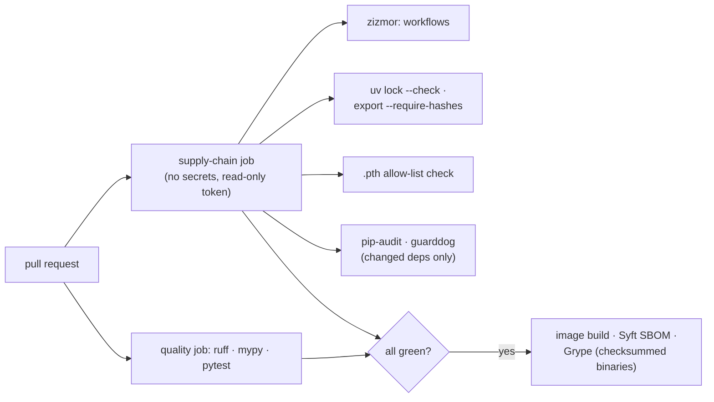

# F0: Foundation, Supply-Chain CI & Spikes

| Milestone | Priority | Depends on | Effort | Unblocks |
|---|---|---|---|---|
| M1 | Must | — | 3.5 h | F1, F2 |

**Goal:** The `switchboard/` repo with the supply-chain controls in place **before the first dependency**,
a local stack in Docker Compose, and four spikes that test the riskiest assumptions from the
[tech stack](../08-tech-stack.md#86-things-to-verify-in-the-first-week-of-building).

## Diagram: CI pipeline



## Deliverables / files
```
pyproject.toml · uv.lock                     # workspace: gateway, admin, evals (router-training separate)
requirements.lock                            # uv export --require-hashes (used by the image)
.github/workflows/ci.yml                     # every action pinned by commit SHA; permissions: {} by default
.github/workflows/supply-chain.yml           # no secrets; zizmor, lock check, .pth check, audits
scripts/check_pth.py                         # fails on any .pth not in scripts/pth_allowlist.txt
infra/compose.yaml                           # redis 8.8, pgvector pg16, prometheus, grafana, toxiproxy
gateway/app.py                               # empty FastAPI app with /healthz
spikes/                                      # S1–S4 notes + scripts (kept, not shipped)
```

## Tasks
- [ ] Repo layout from [02 §2.9](../02-architecture.md#29-proposed-repository-layout); uv workspace; ruff + mypy
- [ ] CI with SHA-pinned actions and `permissions: {}`; supply-chain job with no secrets
- [ ] `.pth` check and zizmor; **plant a bad `.pth` file and an unpinned action in a test branch** and confirm both fail
- [ ] Compose stack up; `vector` extension enabled
- [ ] **S1:** both SDKs stream with `max_retries=0`; record usage fields (cached tokens) and the overloaded / 429 error types
- [ ] **S2:** empty FastAPI SSE relay against a stub: p95 overhead at 500 req/s (the floor for ADR-009)
- [ ] **S3:** scikit-learn 1.9 logistic regression → skl2onnx → onnxruntime; predictions identical
- [ ] **S4:** RouteLLM 0.2 installs in an isolated, hash-locked `router-training/` env (litellm pinned to a known-good version)

## Acceptance criteria
- CI blocks the planted `.pth` file and the tag-pinned action
- Each spike has a one-paragraph written decision (keep, fallback, or change the design)

## Tests
- `check_pth.py` unit test; CI self-test branch

**Interview talking point:** *"The first thing I built was the part that would have stopped the LiteLLM
compromise from reaching me: hash-locked installs, SHA-pinned actions and a check for `.pth` files. I
proved it works by planting one."*
