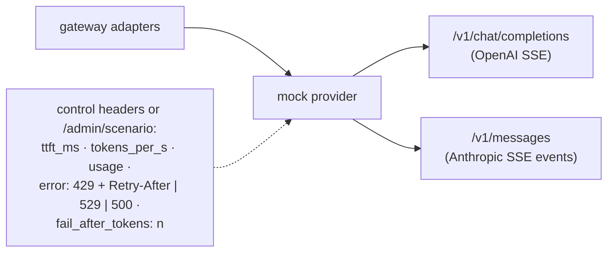

# F1: Mock Provider

| Milestone | Priority | Depends on | Effort | Unblocks |
|---|---|---|---|---|
| M1 | Must | F0 | 2 h | F2, F5, F16 |

**Goal:** A tiny FastAPI service that speaks **both** the OpenAI Chat Completions and the Anthropic
Messages formats (streaming and not), with controllable latency, token rate, usage (including cached
tokens) and error injection. Every later feature can be developed, load-tested and fault-tested at $0.

## Diagram: controls



## Deliverables / files
```
evals/mock_provider/app.py        # both formats; deterministic text from a seed
evals/mock_provider/scenarios.py  # named scenarios: healthy, overloaded, rate_limited, slow_first_token, mid_stream_drop
evals/mock_provider/fixtures/     # SSE event shapes copied from S1's recorded real responses
```

## Tasks
- [ ] Streaming and non-streaming responses in both formats, including tool-call deltas
- [ ] Usage blocks: OpenAI `prompt_tokens_details.cached_tokens`; Anthropic `cache_read_input_tokens` / `cache_creation_input_tokens`
- [ ] Error injection (429 with `Retry-After`, 529 overloaded, 500, connection drop after *n* tokens)
- [ ] Scenario switch per request (header) and globally (admin endpoint) for load tests

## Acceptance criteria
- The official SDKs parse the mock's responses without errors (same client code as production)
- 2,000 req/s from one container with streaming, so the mock is never the bottleneck in F16

## Tests
- SDK round-trip tests for every scenario

**Interview talking point:** *"All the reliability and load testing ran against a mock that speaks both
providers' wire formats, including their usage and error shapes, so I could test a 529 storm without
spending anything."*
