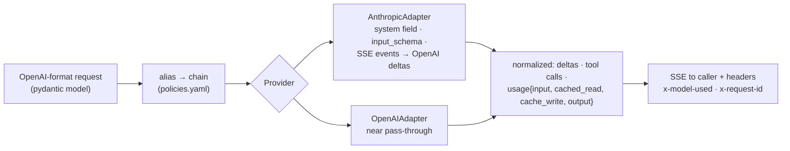

# F2: Provider Adapters & OpenAI-Compatible API

| Milestone | Priority | Depends on | Effort | Unblocks |
|---|---|---|---|---|
| M1 | Must | F0, F1 | 4.5 h (6 with `/v1/messages`) | F3, F5, F7, F10 |

**Goal:** `/v1/chat/completions` (stream and non-stream, tools, `response_format`) and `/v1/models`,
translated to Anthropic and OpenAI through two small adapters built on the official SDKs
([03 §3.3](../03-low-level-design.md#33-translation-openai-format--providers)). Model aliases (`fast`,
`smart`, `auto`) resolve through `policies.yaml`.

## Diagram: adapter interface



## Deliverables / files
```
gateway/api/chat.py               # /v1/chat/completions, /v1/models
gateway/api/schemas.py            # OpenAI request/response models
gateway/providers/base.py         # Provider protocol: translate, stream, complete, usage, classify_error
gateway/providers/anthropic.py
gateway/providers/openai.py
gateway/config/policies.yaml      # aliases → ordered chains with capabilities (tools, json, context)
tests/contract/cassettes/         # vcrpy recordings from real APIs (secrets scrubbed)
```

## Tasks
- [ ] Request schema; alias resolution; model allow-list hook (filled in by F3)
- [ ] Anthropic translation: system prompt, tools, tool results, images (pass-through), structured output (native or tool-forced, per S1)
- [ ] Streaming: SSE events → OpenAI `chat.completion.chunk` deltas, including tool-call argument deltas
- [ ] Usage normalization into one structure for the ledger
- [ ] `classify_error`: retryable (408/429/5xx/overloaded) vs not, and `Retry-After` extraction
- [ ] SDK clients: `max_retries=0`, explicit timeouts, one client per provider per worker
- [ ] (Deferred) `/v1/messages` pass-through with the same auth, limits and ledger

## Acceptance criteria
- The OpenAI Python SDK and the AI SDK's `openai-compatible` provider both work against the gateway unchanged
- The same conversation (with a tool call) gives structurally equal normalized output on both adapters

## Tests
- Contract tests on cassettes: text, tool call, JSON schema, streaming, cached usage
- respx tests for each error class

**Interview talking point:** *"Two small adapters on the official SDKs replaced a 100-provider library. The
contract tests feed one conversation through both and compare tool-call structure and usage, so an SDK
upgrade can't silently change the bill."*
