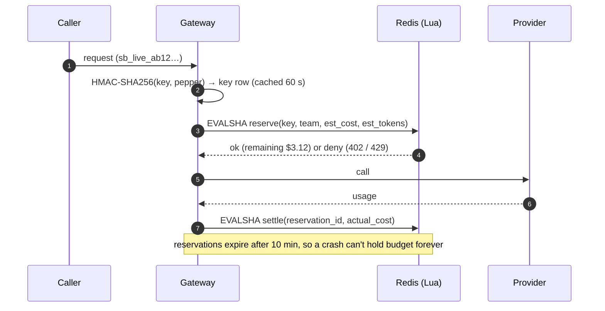

# F3: Virtual Keys, Rate Limits & Budgets

| Milestone | Priority | Depends on | Effort | Unblocks |
|---|---|---|---|---|
| M1 | Must | F2 | 4.5 h | F4, F8 |

**Goal:** Virtual keys per team/app/environment, request and token rate limits, and budgets that
**reserve before the call and settle after** in one atomic Redis script (ADR-008, threat T6). An admin API
and the `swctl` CLI manage all of it.

## Diagram: reserve then settle



## Deliverables / files
```
gateway/auth/keys.py              # key format sb_<env>_<prefix>_<secret>, HMAC lookup, allow-list
gateway/limits/scripts/reserve.lua
gateway/limits/scripts/settle.lua
gateway/limits/budget.py          # estimate (tiktoken / chars ÷ 3.5 × margin), reserve, settle, fail-closed switch
gateway/limits/ratelimit.py       # token buckets: rpm, tpm
admin/api.py                      # keys, teams, budgets, policies; admin token + IP allow-list; audit table
admin/swctl.py                    # Typer CLI
migrations/                       # teams, apps, virtual_keys, policies, admin_audit
```

## Tasks
- [ ] Key issue/revoke/rotate; only the prefix is ever shown after creation
- [ ] Lua scripts: rate limit + budget check-and-reserve in one call; settle with the actual cost
- [ ] Estimate with a safety margin; cap `max_tokens` per alias (denial of wallet, T10)
- [ ] Soft alert at 80% (metric + log event), hard stop at 100% with reset time in the error
- [ ] Fail-closed when Redis is unreachable (configurable per app)
- [ ] Rebuild today's counters from the ledger on startup (wired up once F4 exists)

## Acceptance criteria
- **200 parallel requests against a $1 budget never spend more than $1** (plus at most one reservation's error margin)
- Revoked key → `401` within 60 s (metadata cache TTL)
- Key lookup + limits + reserve ≤ 4 ms p95 on the overhead micro-benchmark

## Tests
- Concurrency test (asyncio gather against real Redis); hypothesis on estimate ≥ 0 and settle idempotency
- Admin auth tests (T8); log scanner finds no full keys

**Interview talking point:** *"Budgets reserve the estimated cost atomically before the call and settle
the real cost after, so 200 parallel requests can't race past the limit. Keys are high-entropy, so an
HMAC is the right hash. A password hash like argon2 would have added tens of milliseconds per request for
no security gain."*
