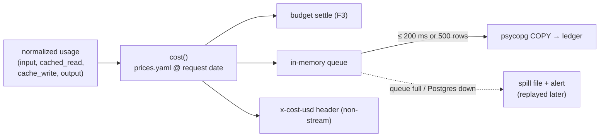

# F4: Prices, Cost Maths & Ledger

| Milestone | Priority | Depends on | Effort | Unblocks |
|---|---|---|---|---|
| M1 | Must | F3 | 3 h | F6, F12 |

**Goal:** A cost for every request from **provider-reported usage** and a versioned price table
([03 §3.9](../03-low-level-design.md#39-cost-computation)), written to a monthly-partitioned ledger in
batches off the request path.

## Diagram: from usage to ledger



## Deliverables / files
```
gateway/config/prices.yaml        # per model: input, cached_read, cache_write (5m/1h), output, valid_from
gateway/ledger/cost.py            # pure function, Decimal maths
gateway/ledger/writer.py          # batched COPY, spill + replay
gateway/ledger/rebuild.py         # today's budget counters from the ledger (used by F3 on startup)
migrations/ledger.sql             # monthly partitions, indexes on (app, at), (key, at)
```

## Tasks
- [ ] Price table with dated entries validated at startup (unknown model → refuse to start)
- [ ] Cost function covering both providers' cached-token schemes; `Decimal`, never floats
- [ ] Ledger row per request with all fields in [03 §3.1](../03-low-level-design.md#31-data-model), including partial usage for mid-stream failures
- [ ] Batched writer, spill file and replay; `rebuild.py` hooked into F3's startup
- [ ] Mid-stream failure rows (`status = partial`) so nothing is silently free

## Acceptance criteria
- Cost for recorded real responses (F2 cassettes) matches a hand calculation to the cent
- Killing Postgres for 60 s loses no ledger rows (spilled, then replayed)

## Tests
- Hypothesis: cost is monotonic in every token count, never negative, and cached reads never cost more than uncached input
- Writer test with Postgres stopped and restarted

**Interview talking point:** *"Every number on the cost dashboard traces back to a provider usage field and
a dated price row. The cost function is property-tested, because a cost bug is a finance bug."*
