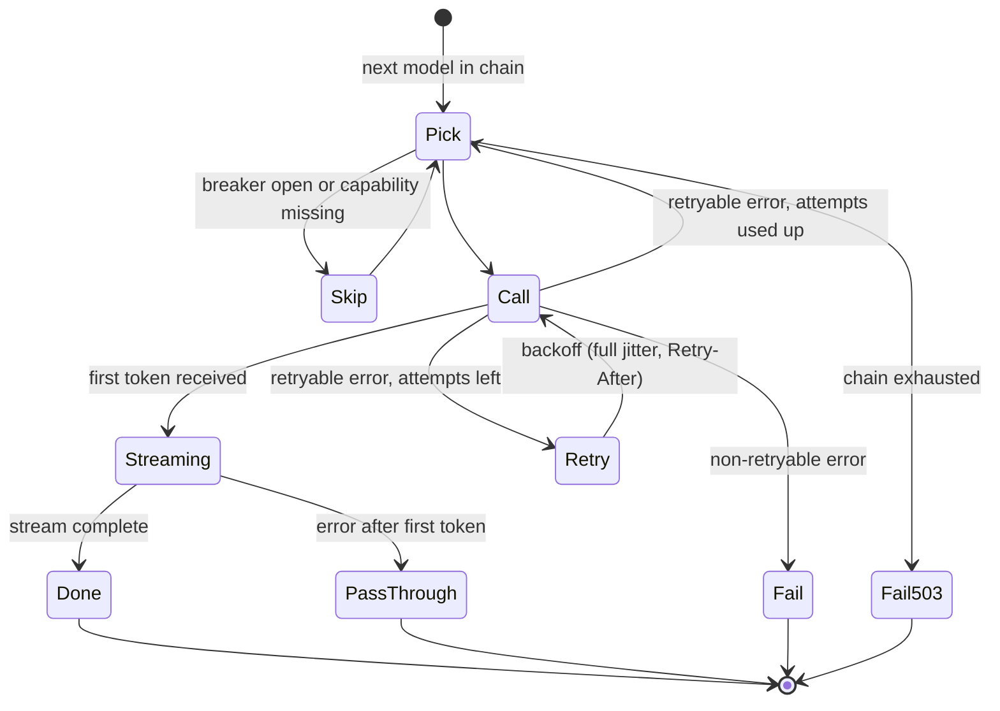

# F5: Reliability: Retries, Breakers, Fallbacks

| Milestone | Priority | Depends on | Effort | Unblocks |
|---|---|---|---|---|
| M1 | Must | F1, F2 | 4.5 h (5.5 with hedging) | F6, F16 |

**Goal:** Stream-aware retries, per-(provider, model) circuit breakers shared through Redis,
capability-checked fallback chains and three timeouts, with the defaults in
[03 §3.8](../03-low-level-design.md#38-reliability-settings-defaults). **No retry or fallback after the
first token is sent** (ADR-007).

## Diagram: call loop



## Deliverables / files
```
gateway/reliability/call.py        # the loop above; first_token_sent flag
gateway/reliability/breaker.py     # Redis-backed state, local fallback when Redis is down
gateway/reliability/backoff.py     # full jitter, Retry-After cap
gateway/reliability/capabilities.py# tools / json / context-length checks per model
tests/faults/                      # Toxiproxy scenarios (from Project 4)
```

## Tasks
- [ ] Timeouts: connect, first-token, total (stream and non-stream)
- [ ] Retries only for retryable classes from F2, with jitter and `Retry-After`
- [ ] Breaker: open after 5 failures in 30 s, half-open with one probe after 20 s; shared state in Redis
- [ ] Fallback chooses the next model whose capabilities cover the request; `x-fallback` header and ledger field
- [ ] Mid-stream error → SSE error event, ledger `status = partial`
- [ ] (Deferred) Hedged requests for the `fast` alias

## Acceptance criteria
- The five tests in [04 §4.5](../04-evaluation-design.md#45-reliability-tests) pass against the mock through Toxiproxy
- A provider hard-down run shows fallback success ≥ 99% and zero retries after a first token

## Tests
- Hypothesis on the breaker state machine; Toxiproxy tests in CI (mock provider, no spend)

**Interview talking point:** *"The retry loop tracks one bit, whether the caller has seen a token. Before
that, anything goes: retry, fall back, skip an open breaker. After that, errors pass through, because
splicing two answers together is worse than an error."*
