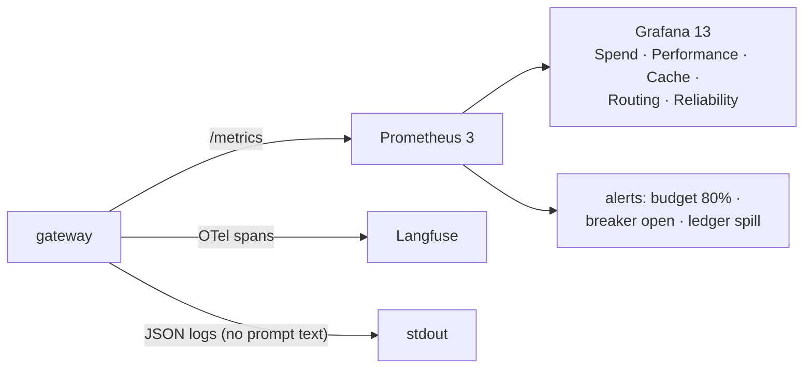

# F6: Observability & Dashboards

| Milestone | Priority | Depends on | Effort | Unblocks |
|---|---|---|---|---|
| M1 | Must | F4, F5 | 2.5 h | F16 |

**Goal:** Prometheus metrics named after the OTel GenAI conventions, one Langfuse trace per request, and
the five Grafana dashboards from [06 §6.4](../06-non-functional.md#64-observability): Spend, Performance,
Cache, Routing and Reliability.

## Diagram: signals



## Deliverables / files
```
gateway/obs/metrics.py            # token usage, cost, cache, route, fallback, breaker, TTFT, overhead
gateway/obs/tracing.py            # one span per request; cache and route decisions as attributes
dashboards/*.json                 # five dashboards, provisioned by compose and Terraform
infra/prometheus/alerts.yml
```

## Tasks
- [ ] Metrics with bounded labels (app, team, model, policy, result), never key or user IDs
- [ ] Gateway overhead histogram (total time minus provider time)
- [ ] Spans into Langfuse with the same attribute names as Projects 1–6
- [ ] Five dashboards and three alerts; screenshots in `docs/`

## Acceptance criteria
- A replayed mock workload fills all five dashboards
- Budget 80% alert fires in a test with a tiny budget

## Tests
- Metric-name and label-cardinality test (fails if a label has more than 50 values in a run)

**Interview talking point:** *"The spend dashboard answers 'why did the bill double?' in two clicks: by
app, then by model or cache status. Every panel reads from the same ledger and metrics the cost report
uses."*
