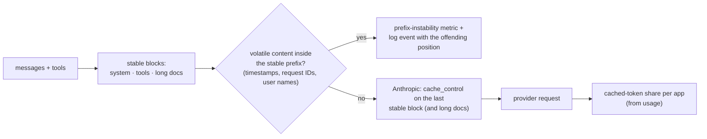

# F7: Prompt-Cache Helper

| Milestone | Priority | Depends on | Effort | Unblocks |
|---|---|---|---|---|
| M2 | Must | F2 | 2.5 h | F15 |

**Goal:** Make the providers' own prompt caching work reliably: find the stable prefix (system prompt,
tool definitions, pinned documents), add Anthropic `cache_control` breakpoints within the provider's
limits, and **report** apps whose prompts defeat caching
([03 §3.4](../03-low-level-design.md#34-prompt-cache-helper)). It never reorders the conversation.

## Diagram: what the helper looks at



## Deliverables / files
```
gateway/cache/prompt.py           # stable-prefix detection, breakpoint insertion, instability check
gateway/cache/prompt_rules.yaml   # min prefix tokens per model, max breakpoints, per-app opt-outs
```

## Tasks
- [ ] Detect the stable prefix; respect the model's minimum cacheable length and breakpoint limit
- [ ] Insert breakpoints for Anthropic; leave OpenAI requests unchanged (automatic caching) but still check stability
- [ ] Instability detector: hash the prefix per app over time, flag changes that aren't a new prompt version
- [ ] Cached-token share per app on the Cache dashboard

## Acceptance criteria
- On a recorded ClauseDesk session, cached input share rises from the baseline to a measured value (reported in F15)
- The detector finds at least one real cache-defeating pattern in P1/P6 traffic, or proves there is none

## Tests
- Unit: breakpoint placement for system-only, tools + system, long document; never more than the limit
- Contract: Anthropic cassette shows `cache_read_input_tokens > 0` on the second call

**Interview talking point:** *"Before building any cache of my own, I made the provider's cache work: a
timestamp at the top of a system prompt can switch caching off without anyone noticing. The helper finds
that, and it's usually the cheapest saving in the whole project."*
