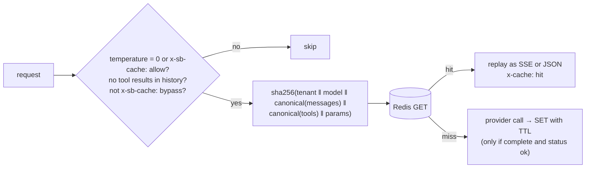

# F8: Exact Cache

| Milestone | Priority | Depends on | Effort | Unblocks |
|---|---|---|---|---|
| M2 | Must | F3 | 2 h | F9 |

**Goal:** Return a stored response only for an **identical, deterministic** request, keyed by a canonical
hash that includes the tenant ([03 §3.5](../03-low-level-design.md#35-caches)), with cache controls and
headers (FR-14, FR-17).

## Diagram: eligibility and key



## Deliverables / files
```
gateway/cache/canonical.py        # canonical JSON: sorted keys, normalized whitespace in roles, no volatile params
gateway/cache/exact.py
admin/api.py                      # + flush per tenant, per prompt version
```

## Tasks
- [ ] Canonicalization that ignores irrelevant differences (key order) but never meaning (message text)
- [ ] Store only complete, successful responses; replay streams as SSE
- [ ] `x-cache`, bypass header, per-tenant flush, TTL per app
- [ ] Ledger: cache hits cost $0 plus a "saved" estimate

## Acceptance criteria
- **P1 (cross-tenant) test:** tenant B with an identical request never gets tenant A's entry
- Exact hit p95 ≤ 5 ms

## Tests
- Hypothesis: canonical(a) = canonical(b) iff the requests are semantically identical under the rules
- Isolation test (P1); streaming replay test

**Interview talking point:** *"The exact cache is simple, which is why the key design matters: the tenant
is inside the hash, and anything with tool results or temperature above zero is never cached."*
