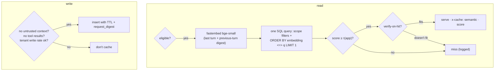

# F9: Semantic Cache (Scoped, Verify-on-Hit)

| Milestone | Priority | Depends on | Effort | Unblocks |
|---|---|---|---|---|
| M2 | Must | F8 | 4.5 h | F13, F17 |

**Goal:** An **opt-in** semantic cache scoped by tenant, model, system-prompt hash and tools hash, with a
per-app threshold, verify-on-hit for high-risk apps and the write defences from
[03 §3.5](../03-low-level-design.md#35-caches) and [02 §2.6](../02-architecture.md#26-data-flow-b-semantic-cache-with-scoping-and-verification).
It ships **off for every app** until F13 picks the thresholds.

## Diagram: read and write paths



## Deliverables / files
```
gateway/cache/semantic.py         # eligibility, embed, lookup, verify, write rules
gateway/cache/embedder.py         # fastembed in a thread pool; model baked into the image
gateway/cache/verify.py           # cheap-model yes/no check; cost logged to the ledger
migrations/sem_cache.sql          # list/hash partitions by tenant; HNSW per partition
```

## Tasks
- [ ] Scope columns and the single filtered HNSW query (`hnsw.iterative_scan` on); check recall on a labelled sample
- [ ] Embed the last user turn plus a short digest of the previous turn
- [ ] Per-app `sem_threshold` and `verify_on_hit` from the policy table
- [ ] Write rules: `x-sb-trust: untrusted-context` and tool results block writes (unless opted in); per-tenant write rate limit; TTL
- [ ] Invalidate a scope when the system-prompt hash changes; per-tenant flush
- [ ] Ledger: verification cost and "saved" estimate on hits

## Acceptance criteria
- **P1 and P4 pass:** no cross-tenant hit; no old answer after a system-prompt change
- Semantic lookup (embed + query) ≤ 35 ms p95; a "no" from verify-on-hit turns into a miss

## Tests
- Isolation tests (P1, P4); write-rule tests (P3 behaviour); recall check on labelled pairs

**Interview talking point:** *"Most semantic-cache tutorials use one global index and one threshold. Mine
matches tenant, model, system prompt and tools exactly before similarity is even considered, and it won't
cache anything built from untrusted content, which closes most of the 2026 poisoning attacks by
construction."*
