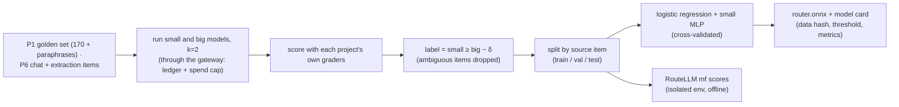

# F10: Router Training Data & Classifier

| Milestone | Priority | Depends on | Effort | Unblocks |
|---|---|---|---|---|
| M3 | Must | F2 | 3.5 h | F11 |

**Goal:** Build labels ("was the small model good enough?") from the eval items of earlier projects, train
the classifier and export it to ONNX ([03 §3.7](../03-low-level-design.md#37-router-training-data)).
RouteLLM's scores for the same items are produced here too, in its isolated environment.

## Diagram: labelling pipeline



## Deliverables / files
```
router-training/pyproject.toml    # separate, hash-locked env (scikit-learn, skl2onnx, routellm)
router-training/label.py          # runs items through the gateway, grades, labels
router-training/features.py       # embedding + length + task tag + tools/json flags (same code path as the gateway)
router-training/train.py          # CV, calibration, export
router-training/routellm_scores.py
router-training/out/              # router.onnx, model_card.json, routellm_scores.parquet
```

## Tasks
- [ ] Run the item sets through the gateway with a dedicated key and a hard budget
- [ ] Labels with margin δ; report label agreement between the two runs
- [ ] Features computed by **the same function** the gateway uses (no train/serve skew)
- [ ] Train, calibrate, export; verify ONNX predictions equal scikit-learn's on the test split
- [ ] RouteLLM `mf` scores for every test item

## Acceptance criteria
- No item appears in more than one split
- ONNX model loads in the gateway and scores in ≤ 2 ms

## Tests
- Split-leakage test; ONNX/sklearn parity test; feature-parity test (training vs gateway)

**Interview talking point:** *"The router's training labels came from my own earlier projects: run both
models on every eval item, grade them with the project's real graders, and label whether the small model
was good enough. Splitting by source item kept paraphrases from leaking between train and test."*
