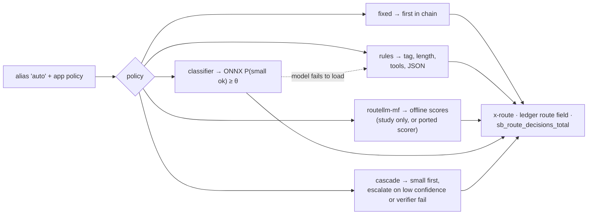

# F11: Routing Policies (Five)

| Milestone | Priority | Depends on | Effort | Unblocks |
|---|---|---|---|---|
| M3 | Must | F10 | 4 h (5 with external benchmark) | F14, F17 |

**Goal:** Five selectable policies per app, `fixed`, `rules`, `routellm-mf`, `classifier` and `cascade`
([03 §3.6](../03-low-level-design.md#36-routing-policies)), each logging `policy:decision:score`. A caller
can pin a model to bypass routing (FR-20).

## Diagram: policy dispatch



## Deliverables / files
```
gateway/router/base.py            # Policy protocol: decide(request) → (model, decision, score)
gateway/router/rules.py
gateway/router/classifier.py      # onnxruntime session, loaded once, thread-pool inference
gateway/router/cascade.py         # non-streaming only; confidence prompt + optional grader verifier
gateway/router/routellm_mf.py     # reads offline scores in the study; ported scorer only if it wins
```

## Tasks
- [ ] Policy per app from the policy table; threshold per app
- [ ] `rules` baseline written from what P1/P6 traffic actually looks like
- [ ] Classifier with fallback to `rules` if the model file is missing or fails a checksum
- [ ] Cascade: confidence from a small JSON self-rating (or log-probs where available); escalation logged
- [ ] RouteLLM in the study via F10's offline scores; port the scorer only if it wins for an app
- [ ] (Deferred) External check on an LLMRouterBench subset

## Acceptance criteria
- Every routed request has a `policy:decision:score` in the ledger and trace
- Router step ≤ 2 ms p95 for `rules` and `classifier`

## Tests
- Unit per policy; fallback when the model is missing; cascade escalation paths on the mock

**Interview talking point:** *"I shipped five routers behind one interface so the study could compare them
fairly. RouteLLM never runs inside the gateway: it has an unpinned dependency on LiteLLM, so it scores
items offline in its own locked environment."*
