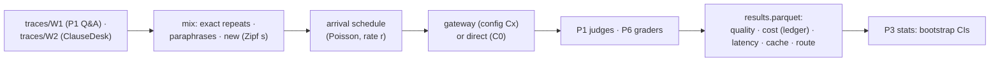

# F12: Trace Recording & Replayer

| Milestone | Priority | Depends on | Effort | Unblocks |
|---|---|---|---|---|
| M4 | Must | F4 | 3 h (4.5 with W3) | F13, F14 |

**Goal:** Recorded request traces from earlier projects (public data only) and a replayer that re-sends
them with realistic arrival times and a **Zipf repetition model**, scoring quality with each project's
own graders ([04 §4.1](../04-evaluation-design.md#41-workloads-trace-replay)).

## Diagram: replay loop



## Deliverables / files
```
traces/W1/ · traces/W2/           # anonymized request bodies + item IDs for grading (no customer data)
evals/replay/record.py            # capture from P1/P6 runs via a recording key
evals/replay/mix.py               # repetition model with a seed
evals/replay/run.py               # async sender; C0 direct mode; per-config app keys
evals/replay/score.py             # joins ledger + graders + stats
```

## Tasks
- [ ] Record W1 and W2 traces; check that no private data is in them
- [ ] Repetition model with repeat rate as a parameter, so the report can show savings vs repeat rate
- [ ] C0 "direct to provider" mode for the baseline
- [ ] Results joined with ledger rows by request ID; CIs with Project 3's statistics module
- [ ] (Deferred) W3: 1,000 sampled P3 agent sub-calls

## Acceptance criteria
- A seeded replay is reproducible (same mix, same order)
- W1 + W2 run end to end on C1 with quality scores and cost per 1k requests

## Tests
- Mix distribution test; join completeness (every request has a ledger row and a grade)

**Interview talking point:** *"Savings from caching depend on how often users repeat themselves, so I
didn't assume a number: the replayer makes the repeat rate a dial and the report shows savings across it."*
