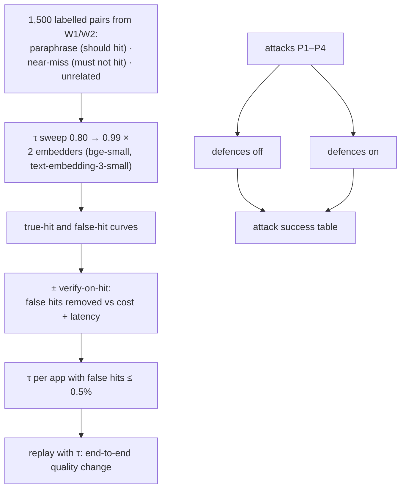

# F13: Semantic-Cache Study & Poisoning Tests

| Milestone | Priority | Depends on | Effort | Unblocks |
|---|---|---|---|---|
| M4 | Must | F9, F12 | 3.5 h | F15 |

**Goal:** Choose τ per app from **hit vs false-hit curves**, measure what verify-on-hit buys, and run the
poisoning attacks P1–P4 with defences off and on ([04 §4.3](../04-evaluation-design.md#43-semantic-cache-study)).

## Diagram: study design



## Deliverables / files
```
evals/cache_study/pairs.py        # generate + hand-check near-misses (years, countries, negations, entities)
evals/cache_study/sweep.py
evals/cache_study/attacks.py      # P1 cross-tenant, P2 collision, P3 poisoned context, P4 prompt change
reports/cache-study.md            # curves, chosen τ, attack table
```

## Tasks
- [ ] Build pairs; hand-check at least 200 near-misses (the pairs that matter)
- [ ] Sweep both embedders; plot curves; pick τ per app; record the choice in `policies.yaml`
- [ ] Verify-on-hit on vs off at the chosen τ
- [ ] P2 collision attack: craft prompts close to popular questions, try to plant an answer; measure success rate
- [ ] Attack table: off vs on for P1–P4

## Acceptance criteria
- A τ per app with a CI on its false-hit rate
- P1, P3, P4 fail with defences on; P2's success rate is measured and reported, not assumed zero

## Tests
- The attacks become CI tests (P1 and P4 blocking; P2/P3 in the nightly job)

**Interview talking point:** *"The near-miss pairs, like 2022 vs 2023 revenue, are where semantic caches
go wrong, so I hand-checked those, picked the threshold that kept false hits under half a percent, and
showed the collision attack working with the defences off."*
