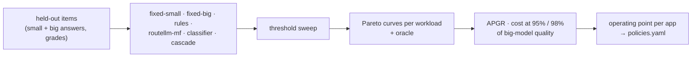

# F14: Routing Pareto Study

| Milestone | Priority | Depends on | Effort | Unblocks |
|---|---|---|---|---|
| M4 | Must | F11, F12 | 3 h | F15 |

**Goal:** Cost vs quality curves for every policy and a threshold sweep, against an **oracle** upper bound,
on the held-out test items ([04 §4.4](../04-evaluation-design.md#44-routing-evaluation)). The shipped
policy and threshold per app come from these curves.

## Diagram: analysis



## Deliverables / files
```
evals/routing/pareto.py           # offline: reuses F10's graded answers, no new model calls except cascade
evals/routing/cascade_run.py      # cascade needs live calls (confidence prompt)
reports/routing-study.md
```

## Tasks
- [ ] Curves from F10's graded answers (cheap: no new calls for most policies)
- [ ] Live cascade run on the test items (k=2) to capture confidence and escalation cost
- [ ] APGR and cost at fixed quality targets, with bootstrap CIs
- [ ] Latency effect of cascades (second call on escalation)
- [ ] Choose the operating point per app and write it to the policy table

## Acceptance criteria
- Every policy on one chart per workload with the oracle
- A written justification for each app's chosen policy and threshold

## Tests
- Oracle sanity (it's never beaten); reproducible curves from a seed

**Interview talking point:** *"On a Pareto chart you can see exactly how much of the gap between 'always
small' and 'always big' each router recovers, and at what price. I shipped whichever point met the
quality budget at the lowest cost, not the most sophisticated router."*
