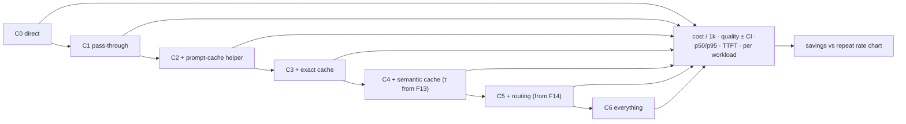

# F15: Cost Report (C0–C6) & Cost Accuracy

| Milestone | Priority | Depends on | Effort | Unblocks |
|---|---|---|---|---|
| M4 | Must | F7, F13, F14 | 3 h | F18 |

**Goal:** The headline table: **cost per 1k requests, quality with CI, p50/p95 latency and TTFT** for
configurations C0–C6 on W1 and W2 ([04 §4.2](../04-evaluation-design.md#42-configurations-compared)), plus
the ledger-vs-provider accuracy check ([04 §4.7](../04-evaluation-design.md#47-cost-accuracy)).

## Diagram: configurations



## Deliverables / files
```
evals/report/configs.yaml         # C0–C6 as app policies (one app key per config)
evals/report/run_all.py           # replays W1 + W2 per config, k=2
evals/report/accuracy.py          # ledger vs provider usage (console exports / usage API)
reports/cost-report.md            # tables, charts, findings, recommended config per app
```

## Tasks
- [ ] One app key per configuration so the ledger separates them cleanly
- [ ] Replay W1 + W2 across C0–C6 (cheap models for the sweep, recorded main-model run for the headline)
- [ ] Quality change with CIs vs C0; flag any config beyond the 2-point quality budget
- [ ] Savings vs repeat rate chart (from F12's dial)
- [ ] Ledger vs provider usage for one replay day: within 1%; cached-token accounting checked on both providers

## Acceptance criteria
- The headline table exists for both workloads with CIs
- The report states which layer saved the most for the least risk (ADR-004's prediction, confirmed or not)

## Tests
- Report numbers regenerate from `results.parquet` with one command

**Interview talking point:** *"The table says what each layer saved and what it cost in quality, with
confidence intervals. On my workloads, prompt caching was [fill in: the biggest / not the biggest]
saving, and the semantic cache added [fill in] at a false-hit rate of [fill in]."*
