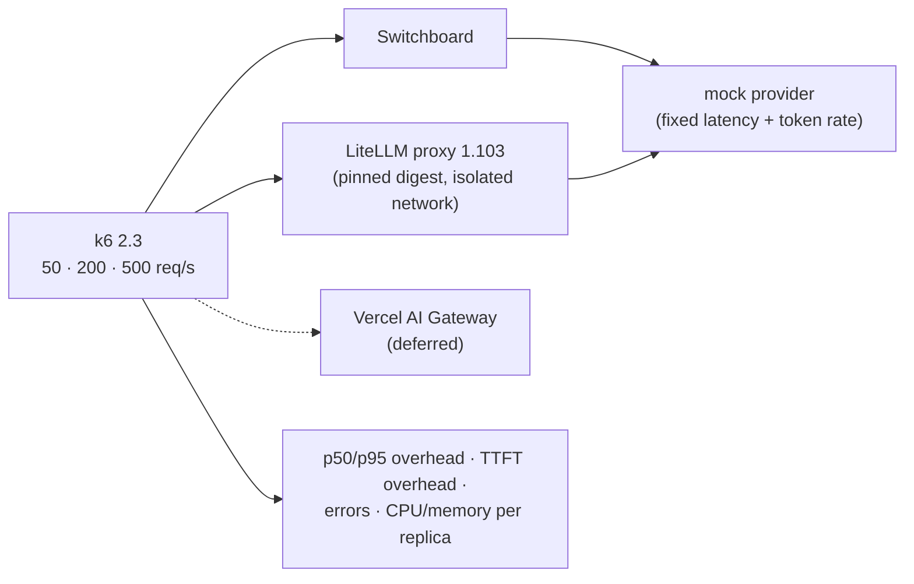

# F16: Overhead, Load & Build-vs-Buy

| Milestone | Priority | Depends on | Effort | Unblocks |
|---|---|---|---|---|
| M4 | Must | F5, F6 | 2.5 h (3.5 with managed gateway) | F18 |

**Goal:** Gateway overhead and TTFT overhead at 50 / 200 / 500 req/s against the mock provider, with
caches on and off, and the same k6 scenario against the pinned **LiteLLM proxy**
([04 §4.6](../04-evaluation-design.md#46-overhead-and-load)).

## Diagram: bench setup



## Deliverables / files
```
evals/load/k6/overhead.js         # non-stream + stream scenarios
evals/load/litellm/               # compose file, config.yaml pointing at the mock, image digest
evals/load/micro.py               # fast in-CI micro-benchmark (the §4.8 gate)
reports/overhead-build-vs-buy.md  # numbers + feature table + "when to buy"
```

## Tasks
- [ ] k6 scenarios with fixed provider latency so overhead = measured − mock latency
- [ ] Profile the hot path (py-spy) if p95 > 15 ms; fix the top item; re-measure
- [ ] LiteLLM proxy on an isolated network, pinned by digest, mock-only config (no real keys)
- [ ] Feature table: keys, budgets, caches, routing, fallbacks, observability, supply-chain surface
- [ ] CI micro-benchmark (blocks merge if p95 overhead > 15 ms)
- [ ] (Deferred) Managed gateway comparison

## Acceptance criteria
- Overhead numbers at three load levels for both gateways
- A "when you should buy instead" section with concrete conditions

## Tests
- The CI micro-benchmark itself (stable within ±10% across three runs)

**Interview talking point:** *"I measured my gateway against LiteLLM on the same mock. Mine added [fill in]
ms at p95, and I say plainly when a team should just buy one: most of the time, unless the gateway itself
is the product or the risk."*
