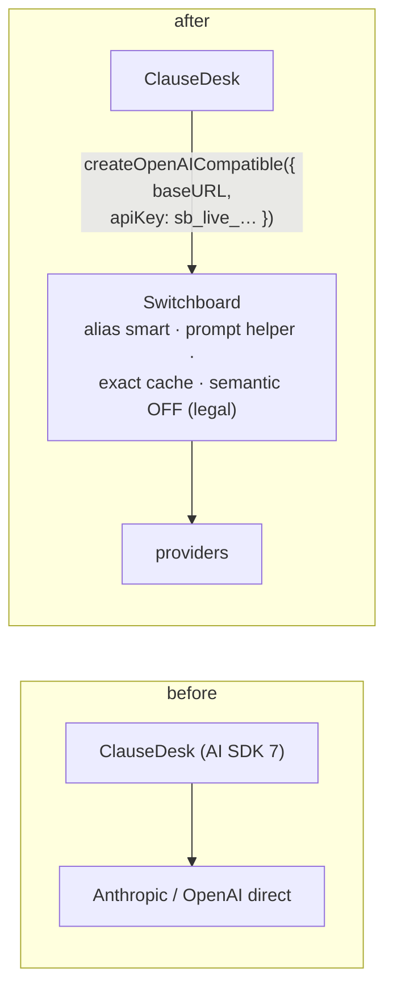

# F17: App Integrations (ClauseDesk First)

| Milestone | Priority | Depends on | Effort | Unblocks |
|---|---|---|---|---|
| M5 | Must | F9, F11 | 1 h (2 with P1 + P5) | F18 |

**Goal:** ClauseDesk (Project 6) sends its model calls through Switchboard with a **one-line provider
change**, and shows its cost before and after.

## Diagram: the switch



## Deliverables / files
```
(ClauseDesk repo) packages/ai/model.ts   # provider factory switched by env: direct or gateway
switchboard/admin/seed/clausedesk.yaml   # team, app, keys, budgets, policy (semantic cache off)
reports/clausedesk-before-after.md
```

## Tasks
- [ ] ClauseDesk app, keys and budget; semantic cache **off** (legal data, per ADR-004)
- [ ] Provider factory switch; run ClauseDesk's own eval smoke through the gateway
- [ ] Before/after: cost per 1k requests, cached-token share, TTFT, quality on the smoke set
- [ ] (Deferred) Project 1 (Python OpenAI SDK) and Project 5 (AI SDK) routed the same way

## Acceptance criteria
- ClauseDesk's smoke evals pass through the gateway with no code changes beyond the provider factory
- Before/after table committed

## Tests
- ClauseDesk's existing Playwright smoke on a preview with the gateway URL

**Interview talking point:** *"Switching ClauseDesk to the gateway was one line in its provider factory,
and it immediately got fallbacks, budgets and a cost dashboard. The semantic cache stays off for it:
legal answers are exactly where a near-miss hit would hurt."*
