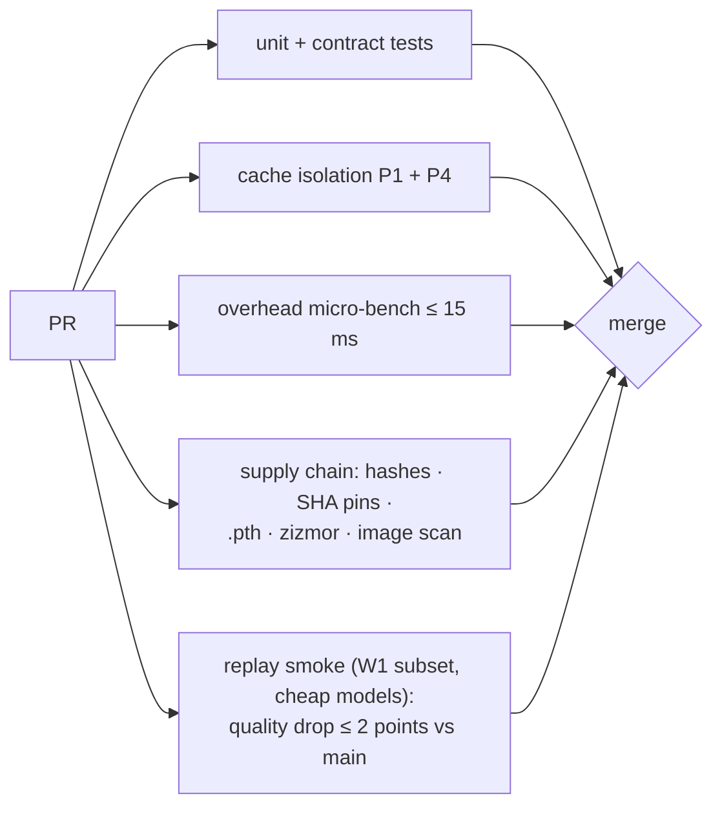

# F18: Deploy, CI Gate, Demo, Report & Video

| Milestone | Priority | Depends on | Effort | Unblocks |
|---|---|---|---|---|
| M5 | Must | F15, F16, F17 | 3.5 h | Capstone |

**Goal:** Switchboard on Azure Container Apps with Key Vault and restricted egress, the full CI gate from
[04 §4.8](../04-evaluation-design.md#48-ci-gate), and the public write-up: README results, a post and a
3-minute video.

## Diagram: CI gate



## Deliverables / files
```
infra/terraform/                  # Container Apps (gateway ×2, admin, redis, prometheus, grafana), Key Vault, identity
infra/terraform/egress.tf         # allow-list: provider API domains, Postgres, Redis, Key Vault, Langfuse
.github/workflows/deploy.yml      # OIDC to Azure; image by digest
README.md                         # results tables + charts + build-vs-buy + "when to buy"
docs/post.md · docs/video-script.md
```

## Tasks
- [ ] Terraform apply; provider keys only in Key Vault; managed identity with Key Vault read only
- [ ] Egress test: a request to a non-allowed domain from the gateway container fails
- [ ] Wire all gate checks; the replay smoke runs with a spend cap enforced by the gateway itself
- [ ] Demo script: outage (breaker + fallback), cache hit with headers, routing decision, spend dashboard
- [ ] README results, post and 3-minute video

## Acceptance criteria
- A PR that breaks tenant scoping or adds an unpinned action is blocked
- Public demo URL (scaled to zero between sessions) and the video link in the README

## Tests
- The gate itself; egress test; smoke against the deployed URL

**Interview talking point:** *"The CI gate checks the things a gateway can get wrong: cross-tenant cache
hits, overhead, quality on a replay, and the supply chain. A PR can't make it cheaper by making it worse
without the gate saying so."*
