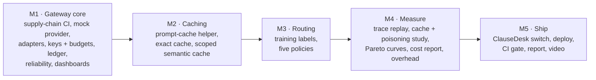
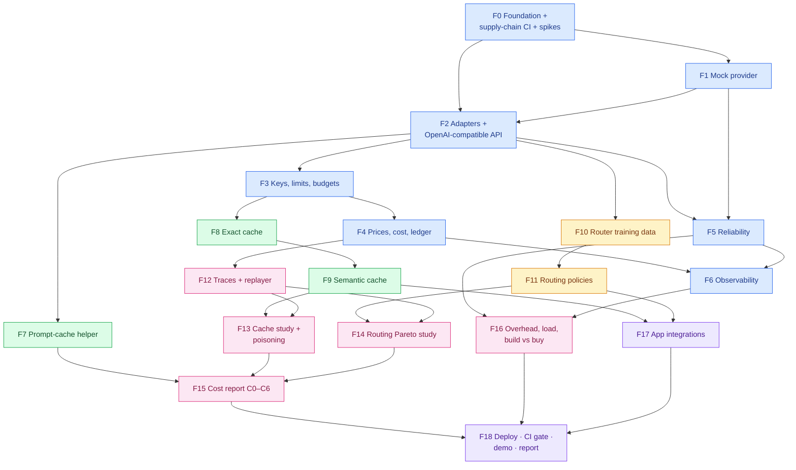
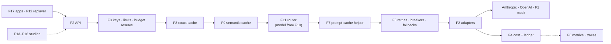
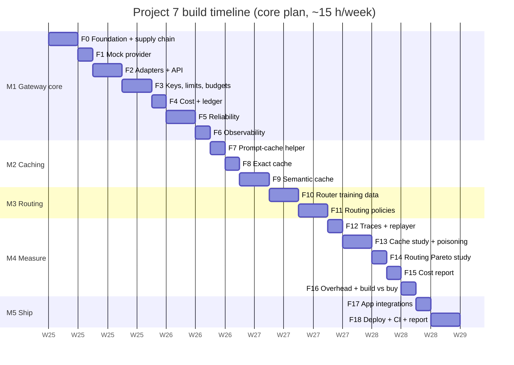

# 9. Build Plan: Feature by Feature

This plan splits Project 7 into **19 features** (F0–F18), grouped into **5 milestones**. Every feature has
its own page with diagrams, files, tasks, acceptance criteria, tests, an estimate and an interview
talking point.

**Prerequisites:**
- Project 1's golden set and judges, and Project 6's CUAD graders and chat questions: they supply the
  workloads and the quality scores.
- Project 3's statistics module (bootstrap CIs) and OpsDesk runs (the optional W3 workload).
- Project 4's Toxiproxy setup, and the shared Azure Terraform modules and Postgres server.

## 9.1 Build strategy: a safe pipe first, then savings, then the evidence

Five rules:
1. **Supply chain before the first dependency.** Hash-locked installs, SHA-pinned actions, zizmor and the
   `.pth` check land in F0, before any package is added. A planted bad example must fail CI.
2. **Mock provider first.** Every feature is testable against the mock (F1) at $0. Real providers are only
   for contract cassettes and recorded evaluation runs.
3. **Measure from day one.** The ledger and an overhead micro-benchmark exist in M1, so every later
   feature shows its cost and latency on the dashboard the day it lands.
4. **Safety before savings.** Cache isolation tests (P1, P4) are written with the caches, before any app
   turns a cache on. The semantic cache stays off by default until F13 picks a threshold.
5. **Each feature ends with a PR, green CI and a `CHANGELOG.md` entry.**

## 9.2 Master diagram: how the features connect

Arrows mean **"is required by"** (build the source first). Colours show milestones.

**Legend:** blue = M1 Gateway core · green = M2 Caching · amber = M3 Routing · pink = M4 Measure ·
purple = M5 Ship.

## 9.3 Runtime integration map

Where each feature sits in the request pipeline ([02 §2.4](../02-architecture.md#24-the-request-pipeline)):

## 9.4 Feature index

| ID | Feature | Milestone | Priority | Depends on | Effort (h) | Page |
|---|---|---|---|---|---|---|
| F0 | Foundation, supply-chain CI & spikes | M1 | Must | — | 3.5 | [F00](F00-foundation.md) |
| F1 | Mock provider | M1 | Must | F0 | 2 | [F01](F01-mock-provider.md) |
| F2 | Provider adapters & OpenAI-compatible API | M1 | Must | F0, F1 | 4.5 (6 with `/v1/messages`) | [F02](F02-adapters-api.md) |
| F3 | Virtual keys, rate limits & budgets | M1 | Must | F2 | 4.5 | [F03](F03-keys-limits-budgets.md) |
| F4 | Prices, cost maths & ledger | M1 | Must | F3 | 3 | [F04](F04-cost-ledger.md) |
| F5 | Reliability: retries, breakers, fallbacks | M1 | Must | F1, F2 | 4.5 (5.5 with hedging) | [F05](F05-reliability.md) |
| F6 | Observability & dashboards | M1 | Must | F4, F5 | 2.5 | [F06](F06-observability.md) |
| F7 | Prompt-cache helper | M2 | Must | F2 | 2.5 | [F07](F07-prompt-cache-helper.md) |
| F8 | Exact cache | M2 | Must | F3 | 2 | [F08](F08-exact-cache.md) |
| F9 | Semantic cache (scoped, verify-on-hit) | M2 | Must | F8 | 4.5 | [F09](F09-semantic-cache.md) |
| F10 | Router training data & classifier | M3 | Must | F2 | 3.5 | [F10](F10-router-training.md) |
| F11 | Routing policies (five) | M3 | Must | F10 | 4 (5 with external benchmark) | [F11](F11-routing-policies.md) |
| F12 | Trace recording & replayer | M4 | Must | F4 | 3 (4.5 with W3) | [F12](F12-trace-replay.md) |
| F13 | Semantic-cache study & poisoning tests | M4 | Must | F9, F12 | 3.5 | [F13](F13-cache-study.md) |
| F14 | Routing Pareto study | M4 | Must | F11, F12 | 3 | [F14](F14-routing-study.md) |
| F15 | Cost report (C0–C6) & cost accuracy | M4 | Must | F7, F13, F14 | 3 | [F15](F15-cost-report.md) |
| F16 | Overhead, load & build-vs-buy | M4 | Must | F5, F6 | 2.5 (3.5 with managed gateway) | [F16](F16-overhead-build-vs-buy.md) |
| F17 | App integrations (ClauseDesk first) | M5 | Must | F9, F11 | 1 (2 with P1 + P5) | [F17](F17-app-integrations.md) |
| F18 | Deploy, CI gate, demo, report & video | M5 | Must | F15–F17 | 3.5 | [F18](F18-ship.md) |
| | **Total: full plan / core plan** | | | | **~67.5 h / ~60.5 h** | |

## 9.5 Timeline: three options

The roadmap gives Project 7 **1 week** (week 38). Like every project before it, the design is larger:

| Option | Scope | Effort | Weeks |
|---|---|---|---|
| A. Full plan | All features at full scope | ~67.5 h | ~4.5 |
| **B. Core plan (recommended)** | The whole gateway (keys, budgets, ledger, reliability, dashboards), all three cache layers with the full cache study and poisoning tests P1–P4, all five routing policies with Pareto curves, trace replay on **W1 + W2**, the C0–C6 cost report, overhead + build-vs-buy **vs the LiteLLM proxy**, ClauseDesk switched over, Azure deploy and the CI gate. **Deferred:** `/v1/messages` pass-through, hedged requests, the W3 agent workload, the external routing-benchmark check, the managed-gateway comparison, P1/P5 integrations | **~60.5 h** | **4 at ~15 h/week** |
| C. Lean | B with **three routing policies** (`fixed`, `rules`, `classifier`; no RouteLLM, no cascade), **W1 only**, no build-vs-buy run (overhead only), local Docker Compose demo instead of an Azure deploy | ~52 h | ~3.5 |

**Why B:**
- The project's claim is **"every saving has a measured price"**. That needs all three cache layers, the
  poisoning results and real Pareto curves. C keeps the gateway but thins out the evidence.
- RouteLLM and the cascade are what make the routing study credible: an off-the-shelf baseline and the
  pattern most teams actually try. Without them the classifier has nothing to beat except rules.
- The LiteLLM comparison answers the "why not just use X?" question with numbers, which interviewers ask
  first.

**Roadmap impact (to update once you choose):** With B, P7 grows from 1 to 4 weeks, which adds **3 weeks**
and takes the roadmap from ~44 to **~47 weeks (about 11 months)**. With C it adds 2.5 weeks (~46.5 weeks).
If you want to hold the total nearer 10 months, C is the lever here, and the deferred B items can be
added later while interviewing.

**Core plan, week by week** (would be roadmap weeks 38–41)

| Week | Roadmap week | Milestone | Features | Exit check |
|---|---|---|---|---|
| 1 | 38 | M1 | F0 foundation + supply-chain CI + spikes · F1 mock provider · F2 adapters + API · F3 keys, limits, budgets | A streamed, tool-calling request through the gateway to **both** providers and the mock; a planted `.pth` file fails CI; 200 parallel requests never overspend a budget |
| 2 | 39 | M1 → M2 | F4 cost + ledger · F5 reliability · F6 dashboards · F7 prompt-cache helper · F8 exact cache | **Outage demo under Toxiproxy:** breaker opens, fallback serves, no retry after the first token; ledger cost matches provider usage; cached-token share visible per app |
| 3 | 40 | M2 → M4 | F9 semantic cache · F10 router training data · F11 routing policies · F12 traces + replayer | Scoped semantic hits with verify-on-hit; the ONNX router picks a model per request in ≤ 2 ms; W1 + W2 replay end to end with quality scores |
| 4 | 41 | M4 → M5 | F13 cache study + poisoning · F14 Pareto study · F15 cost report · F16 overhead + LiteLLM · F17 ClauseDesk switch · F18 ship | Reports committed; ClauseDesk before/after cost; demo, post and video |

Week 4 is the heaviest (~16.5 h). If it slips, F17 and the video move into week 5.

*(Dates are illustrative: Project 7 starts after Project 5's 4 weeks. One "d" is one working session of
about 2–2.5 hours.)*

**Deferred in B (~7 h)**

| Item | Effort | Value when added |
|---|---|---|
| Anthropic pass-through `/v1/messages` | 1.5 h | Callers using Anthropic-only features keep them |
| Hedged requests for the `fast` alias | 1 h | Lower tail latency; a nice "cost of p99" chart |
| W3 workload (P3 agent sub-calls) | 1.5 h | Savings on agent traffic, which repeats a lot |
| External routing-benchmark check (LLMRouterBench subset) | 1 h | Shows the classifier isn't overfit to your own data |
| Managed-gateway comparison (Vercel AI Gateway) | 1 h | Completes the build-vs-buy table |
| P1 and P5 routed through the gateway | 1 h | The whole portfolio on one gateway |

## 9.6 Milestone exit criteria

| Milestone | Done when |
|---|---|
| **M1 Gateway core** | OpenAI-compatible streaming with tools and JSON works against Anthropic, OpenAI and the mock; keys, limits and budgets enforced (no overspend under concurrency); every request has a ledger row with provider-reported cost; breakers and fallbacks pass the §4.5 tests under Toxiproxy; five Grafana dashboards; supply-chain CI fails on a planted bad example. |
| **M2 Caching** | The helper reports cached-token share per app and fixes one real cache-defeating prompt; exact and semantic caches serve hits with `x-cache` headers; P1 (cross-tenant) and P4 (system-prompt change) tests pass; semantic cache off by default. |
| **M3 Routing** | Labels built from P1/P6 eval items with an item-level split; the classifier exported to ONNX and matching scikit-learn's predictions; all five policies selectable per app, with every decision logged as `policy:decision:score`. |
| **M4 Measure** | W1 + W2 replayed across C0–C6 with quality CIs; the τ per app chosen from false-hit curves; poisoning attacks P1–P4 with defences off vs on; Pareto curves with an oracle; overhead ≤ 15 ms p95 checked against the LiteLLM proxy; ledger within 1% of provider usage. |
| **M5 Ship** | ClauseDesk runs through the gateway with a before/after cost; Azure deploy with Key Vault and egress limits; the §4.8 CI gate blocks a regression; reports, post and video. |

## 9.7 Definition of done (every feature)

- [ ] PR with green CI (lint, types, tests, supply-chain job, overhead micro-benchmark once F16 exists)
- [ ] New dependency → hash-locked, guarddog + pip-audit clean, and justified in the PR (C1 in the [tech stack](../08-tech-stack.md))
- [ ] New pipeline step → its latency on the overhead benchmark and its metric on a dashboard
- [ ] New cache or routing behaviour → isolation/poisoning or quality test first
- [ ] No prompt text, provider key or virtual key in logs (log-scanner test)
- [ ] Docs updated (this plan's checkboxes, the setup guide, `CHANGELOG.md`)

## 9.8 Risk register

| Risk | Impact | Mitigation |
|---|---|---|
| Python overhead above 15 ms p95 | ADR-009 questioned | Spike in F0 on an empty relay; profile in F16; Granian; document the Go relay as the next step |
| Provider SDK behaviour differs from docs (usage fields, overloaded errors, structured output) | Wrong cost or retries | Spike in F0; contract cassettes in F2; parse raw responses as a fallback |
| RouteLLM won't install cleanly (old torch/transformers, unpinned litellm) | Missing baseline | Isolated env spike in F0; reimplement MF scoring from the checkpoint; or drop to four policies and say why |
| Semantic cache shows little value on these workloads | Weaker headline | That *is* a finding: report it next to prompt caching's savings, as ADR-004 predicts |
| Router labels are noisy (graders disagree at k=2) | Poor classifier | Label with a margin δ; drop ambiguous items; report label agreement |
| Evaluation spend overruns | Budget | Mock provider for load; cheap tiers for sweeps; per-run spend caps enforced by the gateway itself |
| A dependency is compromised during the build | The exact risk the project is about | Hash locks, no auto-updates, guarddog on bumps, scanners without secrets |
| Plan longer than the roadmap slot | Capstone slips | Choose B (4 weeks) or C (3.5 weeks); deferred items only while interviewing |
