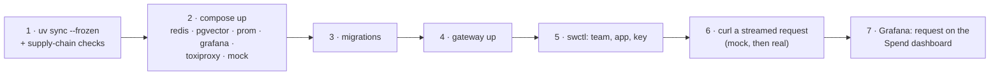

# 10. Setup Guide: accounts, keys and the first run

> **Status:** No code exists yet. This page is the **target setup**: commands become real as F0–F6 are
> built and may change slightly. Keep it in sync with the repo.

## 10.1 What you need, and when

| Needed from | Tool / account | Used for | Cost |
|---|---|---|---|
| **M1** | Python 3.12, **uv**, Docker + Compose, `make` | Gateway, local stack | Free |
| M1 | **Anthropic** and **OpenAI** API keys, each with a **monthly spend limit set in the provider console** | Contract cassettes, evaluation runs | Pay per use; ≈ $30–60 total for the evaluation |
| M1 | **zizmor**, **Syft**, **Grype** (checksummed release binaries), **pip-audit**, **guarddog** | Supply-chain job | Free |
| M1 | **k6**, **Toxiproxy** (from Project 4), **py-spy** | Load, faults, profiling | Free |
| M1 | Langfuse (existing account) | Traces | Free tier |
| **M3** | Project 1 and Project 6 repos checked out next to `switchboard/` | Eval items, graders | — |
| **M5** | **Azure** subscription, Azure CLI, **Terraform** (existing modules) | Container Apps, Key Vault | ≈ $5–30/month; scale to zero |
| (Deferred) | Vercel account with AI Gateway | Managed-gateway comparison | Free credits |

## 10.2 Environment variables

```bash
# --- Gateway (gateway/.env for local; Key Vault references in Azure) ---
ANTHROPIC_API_KEY=                     # provider keys: Key Vault in Azure, never in images or logs
OPENAI_API_KEY=
SB_KEY_PEPPER=<random 32 bytes, base64> # HMAC pepper for virtual keys (Key Vault in Azure)
SB_ADMIN_TOKEN=<random 32 bytes>
SB_ADMIN_ALLOW_IPS=127.0.0.1/32
REDIS_URL=redis://localhost:6379/0
DATABASE_URL=postgresql://switchboard:…@localhost:5432/switchboard
SB_BUDGET_FAIL_MODE=closed             # closed | open (per app override in the policy table)
SB_PROVIDER_BASE_URLS='{"anthropic":"https://api.anthropic.com","openai":"https://api.openai.com/v1","mock":"http://mock:8081"}'
LANGFUSE_PUBLIC_KEY=
LANGFUSE_SECRET_KEY=
OTEL_EXPORTER_OTLP_ENDPOINT=

# --- Evaluation (evals/.env) ---
SB_BASE_URL=http://localhost:8080/v1
SB_EVAL_KEY=sb_dev_…                   # a key with a hard budget for evaluation runs
P1_REPO=../rag-eval-lab
P6_REPO=../clausedesk
```

Provider base URLs come **only** from this allow-list (threat T9). Requests can't choose a URL.

## 10.3 First run



```bash
uv sync --frozen && make supply-chain          # zizmor, lock check, .pth check, pip-audit
docker compose -f infra/compose.yaml up -d
uv run alembic upgrade head
uv run uvicorn gateway.app:app --port 8080 --loop uvloop --http httptools --workers 2
uv run swctl team create demo --monthly-budget 20
uv run swctl app create demo/playground --env dev
uv run swctl key create demo/playground --daily-budget 2 --rpm 60   # prints sb_dev_… once
curl -N http://localhost:8080/v1/chat/completions \
  -H "Authorization: Bearer sb_dev_…" -H "Content-Type: application/json" \
  -d '{"model":"mock-small","stream":true,"messages":[{"role":"user","content":"hello"}]}'
open http://localhost:3001                      # Grafana → Spend
```

## 10.4 Keeping costs safe

| Control | Setting |
|---|---|
| Provider consoles | Monthly spend limits on both provider accounts (the outer fence) |
| Gateway budgets | Every evaluation key has a daily budget; the gateway enforces it (the inner fence) |
| Load and fault tests | Mock provider only; never real providers |
| Sweeps | Cheap model tiers for threshold and policy sweeps; the main model only for recorded headline runs |
| LiteLLM benchmark | Mock-only config; no real provider keys in that container |
| Azure | Scale to zero between demos; budget alert on the resource group |

## 10.5 Troubleshooting

| Symptom | Likely cause | Fix |
|---|---|---|
| Every request is `402` | Budget store unreachable with fail-closed, or counters not rebuilt | Check `REDIS_URL`; run `swctl budgets rebuild` |
| Cost looks too high on Anthropic | Cache writes counted, reads missing | Check the usage mapping in the adapter against a cassette |
| `cache_read_input_tokens` always 0 | Prefix below the minimum length, or volatile content in the prefix | Check the helper's instability events for that app |
| Semantic cache never hits | App not opted in, τ too high, or the scope hash changes every request | Check `x-cache-score`; check the system-prompt hash is stable |
| Router always picks the same model | Model failed to load and fell back to `rules` | Check startup logs for the ONNX checksum error |
| Overhead above 15 ms | Blocking work on the event loop | py-spy; check embeddings and ONNX run in the thread pool |
| CI supply-chain job fails on a new dependency | Missing hash, guarddog finding or new `.pth` file | Re-lock with uv; review the finding; never add to the allow-list without reading the file |
