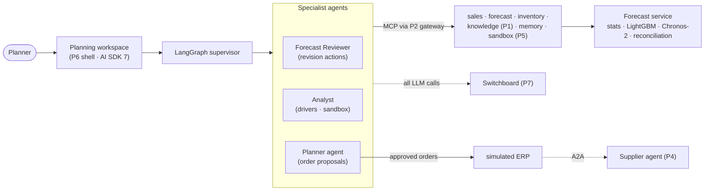

# 🏆 Capstone: Demand-Planning Copilot for CPG (Cadence)

> **Cadence** is a multi-agent demand-planning copilot built on public retail data. Forecasting models
> produce the numbers; LLM agents do the **last mile** a planner does every week: read the promo plan and
> the meeting notes, propose **bounded, evidence-cited adjustments** to the forecast, turn the forecast
> into order proposals, and explain why. Every adjustment is scored with **Forecast Value Added (FVA)**,
> and every order goes through **human approval**. It reuses the platform pieces from Projects 1–7.

**Target roles:** all three: GenAI Engineer, Agent Engineer, AI Full-stack Engineer
**Why this project:** It's **your domain**. You've built forecasting agents for PepsiCo and Unilever; this
rebuilds the idea publicly on open data, so you can walk through it in any interview without NDA problems.
**Status:** 🟡 System design done (no code yet). Tech stack, build plan and setup guide come next.
**Builds on:** [P1](../01-rag-eval-lab/README.md) (RAG + evals) · [P2](../02-mcp-hub/README.md) (MCP gateway, OAuth, Cedar) ·
[P3](../03-agent-reliability-harness/README.md) (LangGraph, approvals, idempotency, pass^k, memory design) ·
[P4](../04-a2a-agent-mesh/README.md) (A2A supplier agent) · [P5](../05-sandboxed-data-analyst/README.md) (sandbox, safe charts) ·
[P6](../06-ai-saas-nextjs/README.md) (Next.js shell, orgs, RLS) · [P7](../07-llm-gateway-router/README.md) (gateway, cost ledger)

> **New here?** Start with [0 · Start here](docs/00-start-here.md): the project in plain English, one
> planning session's journey, and which document to read next.

## Design documents

| # | Document | What it answers |
|---|---|---|
| 0 | [Start Here](docs/00-start-here.md) | The project in plain English, a planning session's journey, reading paths, FAQ |
| 1 | [Requirements](docs/01-requirements.md) | Components, users, functional and non-functional requirements, success criteria, scope |
| 2 | [High-Level Architecture](docs/02-architecture.md) | Context, containers, the weekly planning loop, agent graph, approval flow, deployment |
| 3 | [Low-Level Design](docs/03-low-level-design.md) | Canonical data model, forecast service, revision actions, MCP tools, agent state, order policy, replenishment simulator |
| 4 | [Evaluation Design](docs/04-evaluation-design.md) | Backtests (WRMSSE, WAPE, quantile loss), PlanBench-60 and FVA, replenishment simulation, agent/RAG/security evals, cost |
| 5 | [Security & Threat Model](docs/05-security-threat-model.md) | Planning-specific threats: poisoned notes, runaway orders, cross-tenant data, memory poisoning, model supply chain |
| 6 | [Non-Functional Design](docs/06-non-functional.md) | Latency and cost budgets, batch sizing, observability, failure modes |
| 7 | [Architecture Decision Records](docs/07-decisions.md) | 13 decisions with alternatives and consequences |
| 11 | [Glossary](docs/11-glossary.md) | Demand-planning, forecasting and agent terms in plain English |

Numbers 8–10 and 12 are reserved for the tech stack, build plan, setup guide and market review, matching
Projects 1–7.

## The system at a glance

## Planned deliverables
1. **Cadence**: the planning workspace, agents, MCP tools, forecast service and simulated ERP, deployed with
   seeded public data
2. **Forecast report:** rolling-origin backtests on M5 (WRMSSE, WAPE, scaled quantile loss) for statistical
   baselines, LightGBM, Chronos-2 and an ensemble, with hierarchical reconciliation
3. **FVA report:** did the agents' adjustments beat the statistical forecast on PlanBench-60, and how often
   did they make it worse?
4. **Replenishment report:** fill rate, lost sales and inventory cost in simulation, by forecast source
5. **Agent, RAG and red-team reports**, cost per planning session, and "what failed"
6. Public demo, post and a 3-minute video

## Résumé bullet template
"Built an open-source multi-agent demand-planning copilot (LangGraph, MCP, A2A, Next.js, Chronos-2) on the
M5 dataset; agent forecast adjustments added __ points of FVA (WAPE) over a statistical baseline with a __%
harmful-adjustment rate, improved simulated fill rate by __ points, at $__ per planning session with
CI-gated evals."
