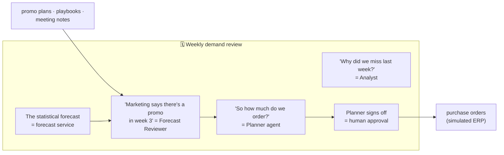

# 0. Start Here: the project in plain English

New to these docs, or preparing for an interview? Read this page first. Unfamiliar terms are explained in
the [glossary](11-glossary.md).

## 0.1 The project in three sentences

1. **Cadence** helps a demand planner do the weekly cycle: check last week's forecast errors, adjust the
   new forecast for things the history can't know (a promotion, a holiday, a new listing), and turn the
   forecast into orders.
2. **Models make the numbers; agents do the judgement.** Statistical, machine-learning and foundation
   forecasting models produce the forecast. LLM agents read the promo plans and meeting notes, propose
   **bounded adjustments with evidence**, explain drivers, and propose orders. A planner approves anything
   that spends money.
3. Everything is **measured the way planning teams measure themselves**: forecast accuracy, **Forecast
   Value Added** (did the adjustment make the forecast better or worse?), fill rate and inventory cost in
   simulation, plus agent reliability, security and cost per session.

## 0.2 Which path should you read?

| You want to… | Read, in this order | Time |
|---|---|---|
| Explain the project in an interview | This page → [Evaluation](04-evaluation-design.md) → [Decisions](07-decisions.md) | 30 min |
| Understand the design | [Requirements](01-requirements.md) → [Architecture](02-architecture.md) → [Low-level design](03-low-level-design.md) | 60 min |
| Understand the security story | [Security](05-security-threat-model.md) | 15 min |
| Understand performance, cost and operations | [Non-functional design](06-non-functional.md) | 10 min |
| Start building | [Tech stack](08-tech-stack.md) → [Build plan](09-build-plan/README.md) → [Setup guide](10-setup-guide.md) | 45 min |

## 0.3 The mental model: an S&OP meeting with a very fast analyst team

| Meeting idea | Real component | Why it matters |
|---|---|---|
| The statistical forecast on the screen | Forecast service (stats, LightGBM, Chronos-2, reconciled) | Numbers come from models that can be backtested |
| "Marketing told us about a promo" | Forecast Reviewer + RAG over promo plans | Context the history doesn't have |
| "Did our overrides help last quarter?" | FVA tracking | Research on judgmental adjustments finds many add little or negative value, so every change is measured |
| "How much do we order?" | Order policy from forecast quantiles + service level | Turns uncertainty into stock decisions |
| The planner signs off | Signed approval tokens (P3) | No order is placed by an AI alone |
| Minutes of the meeting | Revision trace + audit | Every change has a reason and evidence |

## 0.4 One planning session's journey

| Step | What happens |
|---|---|
| 1 | Monday: the nightly job has produced forecasts for all series; Cadence lists **exceptions** (big errors last week, upcoming events, low stock) |
| 2 | The planner opens "Foods, store CA_1" and asks: *"Anything I should change for the next 4 weeks?"* |
| 3 | The Forecast Reviewer searches promo plans and notes (RAG, with citations) and finds a planned price cut on 40 SKUs in week 2 |
| 4 | It proposes a revision action: *"uplift +18% for these 40 series, days 8–14; evidence: promo plan §2.3; similar past promo: +15–22%"*. Code applies it within bounds; the chart shows before/after |
| 5 | The Analyst explains last week's miss: SNAP days shifted, so it fits a quick comparison in the sandbox (P5) |
| 6 | The Planner agent turns the adjusted forecast's quantiles into order proposals at a 95% service level |
| 7 | The planner edits one quantity, approves the rest; orders go to the simulated ERP (idempotent) and a supplier agent confirms over A2A |
| 8 | Cost of the session: $0.21 (from the P7 ledger). Four weeks later, the FVA dashboard shows whether the uplift helped |

## 0.5 What makes this project stand out in interviews

- **Your real domain, public data:** a demand-planning story you can tell end to end without NDAs.
- **LLMs where they belong:** the agent never types a forecast number; it proposes typed, bounded revision
  actions with evidence, applied by code.
- **The metric planners actually use:** Forecast Value Added, including how often the AI made things
  worse.
- **Decisions, not just accuracy:** a replenishment simulation shows the effect on fill rate and inventory.
- **The whole portfolio in one system:** RAG (P1), MCP security (P2), agent reliability (P3), A2A (P4),
  sandboxing (P5), SaaS shell (P6) and the gateway (P7).

## 0.6 FAQ

**Why not let the LLM forecast directly?**
LLMs are poor at producing calibrated numbers over thousands of series, and their errors are hard to
audit. Forecasting models are cheap, fast and backtestable. The LLM adds the one thing they lack: reading
unstructured business context. ([ADR-001](07-decisions.md))

**Why Walmart M5 data for a CPG copilot?**
It's the best-known public retail dataset: 30,490 product-store series with prices, events and SNAP days,
in a real hierarchy. CPG demand planners forecast exactly this kind of retail sell-through. Its Kaggle
terms limit redistribution, so the public demo uses FreshRetailNet-50K (CC BY 4.0). ([ADR-004](07-decisions.md))

**Isn't this just Projects 1–7 glued together?**
The reuse is deliberate, but the new parts are the hardest: the forecast service and backtests, typed
revision actions, FVA measurement and the replenishment simulator.

**Is this the code?**
Not yet. These are the design documents, [tech stack](08-tech-stack.md) and [build plan](09-build-plan/README.md),
written before any code.
